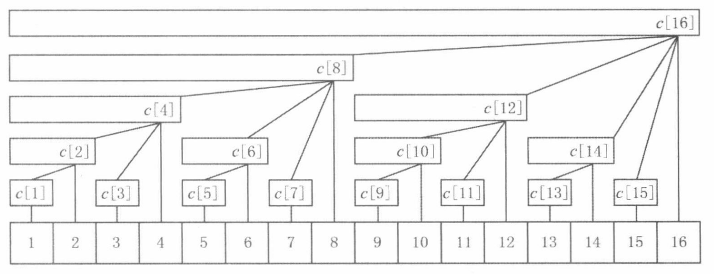

# 一、栈
定义：栈是一种后进先出(FILO/LIFO)的数据结构。

数据结构：
- `Deque<Object> stack = new ArrayDeque<>();`  
- `Deque<Object> stack = new LinkedList<>();`
- `Stack<Object> stack = new Stack<>()`

方法：`E peek(), push(e), E pop()`

<font color="lightblue">提示</font>：栈中的元素可以是值，也可以是指向这个值的索引。

## 1.1 单调栈
### 1.1.1 单调递减栈
定义：栈中存放的是<font color="red">单调递减的元素</font>，栈顶的元素比栈内元素都大。  

代码模板(以int为例)：
```  java
// 数组 int[] nums
int[] nums = new int[] {0,1,0,2,1,0,1,3,2,1,2,1};
Deque<Integer> stack = new ArrayDeque<>();
for (int i = 0; i < nums.length; i++) {
    int x = nums[i];
    while (!stack.isEmpty() && x >= nums[stack.peek()]) {
        int y = stack.pop();
        // 其他内部处理
    }
    stack.push(i);
}
```

题目：
- [T42.接雨水](https://leetcode.cn/problems/trapping-rain-water/description/)

### 1.1.2 单调递增栈
定义：栈中存放的是<font color="red">单调递增的元素</font>，栈顶的元素比栈内元素都小。

代码模板：
```java

```

题目：

# 二、双指针
定义：用两个指针指向数组元素，移动指针，寻找满足条件的元素。

## 2.1 快慢指针
快慢指针：快指针每次移动两步，慢指针每次移动一步，当快慢指针相遇时，慢指针所在位置就是结果。  
场景：常用于寻找链表环的入口或者判断链表有没有环。

代码模板：
```java

```

题目：

## 2.2 同向双指针
定义：两个指针同时移动，一个指针比另一个指针先移动，寻找满足条件结果。  

代码模板(以T3. 无重复的最长字串)：

```java
public int lengthOfLongestSubstring(String s) {
	char[] chs = s.toCharArray();
	int n = chs.length;
	int res = 0;
	int[] cnt = new int[128];
	// s[i,j]表示子串
	int overload = 0;
	for(int i = 0, j = 0;j < n;++j) {
		while(cnt[chs[j]] > 0) {
			cnt[chs[i]]--;
			i++;
		}
		cnt[chs[j]]++;
		res = Math.max(res, j - i + 1);
	}
	return res;
}
```

题目：

## 2.3 相向双指针
定义：两个指针分别指向数组的头和尾，通过移动指针，寻找满足条件结果。

代码模板(以T42. 接雨水为例)：
```java
/**
 * T42.接雨水
 * @param height 柱子高度
 * @return 可以接的雨水量
 */
public int trap(int[] height) {
    int n = height.length, res = 0;
    int l = 0, r = n - 1;
    int preMax = 0, sufMax = 0;
    while(l < r) {
        int hL = height[l], hR = height[r];
        preMax = Math.max(preMax, hL);
        sufMax = Math.max(sufMax, hR);
        // 谁小谁先移动
        if(preMax  < sufMax){
            res += preMax - hL;
            l++;
        }else{
            res += sufMax - hR;
            r--;
        }
    }
    return res;
}
```

题目：
- [T42.接雨水](https://leetcode.cn/problems/trapping-rain-water/description/)


# 三、回溯
定义：使用递归，配合剪枝并恢复现场得到所有结果。

代码模板(以括号生成为例):
```java
private void dfs(int left, int right, StringBuilder sb, int n){
    // 剪枝
    if(left > n || right > n) return;
    // 满足条件
    if(left + right == 2 * n) {
        // res定义为全局即可
        res.add(sb.toString());
    }
    if(left < n){
        sb.append("(");
        // 递归
        dfs(left + 1, right, sb, n);
        // 恢复现场
        sb.deleteCharAt(sb.length() - 1);
    }
    if(right < left){
        sb.append(")");
        // 递归
        dfs(left, right + 1, sb, n);
        // 恢复现场
        sb.deleteCharAt(sb.length() - 1);
    }
}
```

题目:  
- [T22.括号生成](https://leetcode.cn/problems/generate-parentheses/description/)

# 四、动态规划
定义：通过递推公式，将问题转化为子问题，得到结果。

注：要学会寻找<font color="lightblue">状态转移机(DP)</font>

## 4.1 一维DP
定义：一维DP数组，`dp[i]`表示组成i所需要的最小硬币数。

代码模板(以T322.零钱兑换为例):
```java
public int coinChange(int[] coins, int amount) {
    int[] dp = new int[amount + 1];
    Arrays.fill(dp, amount + 1);
    int n = coins.length;
    dp[0] = 0;
    for(int i = 1;i <= amount;++i) {
        for(int c: coins){
            if(i - c < 0) continue;
            // 递推公式
            dp[i] = Math.min(dp[i], dp[i - c] + 1);
        }
    }
    return dp[amount] < amount + 1 ? dp[amount] : -1; 
}
```

题目:
- [T322.零钱兑换](https://leetcode.cn/problems/coin-change/description/)

## 4.2 多维DP
代码模板(以T.188 买卖股票的最佳时机IV)：

```java
public int maxProfit(int k, int[] prices) {
    int n = prices.length;
    // f[i][j][0] 表示第i天交易j次未持有股票
    // f[i][j][1] 表示第i天交易k次持有股票
    int[][][] f = new int[n+1][k+1][2];
    for(int j = 0; j <= k;++j) {
        // 第0天持有股票是非法的，设为一个极小值就好
        f[0][j][1] = -3000;
    }
    for(int i = 0;i < n;++i) {
        for(int j = 1;j <= k;++j) {
            // 要么与昨天保持一致，要么在昨天的基础上卖出股票
            // 卖出股票，交易次数不变(写在了买入)
            f[i+1][j][0] = Math.max(f[i][j][0], f[i][j][1] + prices[i]);
            // 要么与昨天保持一致，要么在昨天的基础上买入股票
            // 购买股票，交易次数要+1
            f[i+1][j][1] = Math.max(f[i][j][1], f[i][j-1][0] - prices[i]);
        }
    }
    return f[n][k][0];
}

// 优化空间复杂度(同01背包一样需要逆序遍历)
public int maxProfit(int k, int[] prices) {
    int n = prices.length;
    // f[i][j][0] 表示第i天交易j次未持有股票
    // f[i][j][1] 表示第i天交易k次持有股票
    int[][] f = new int[k+1][2];
    for(int j = 0; j <= k;++j) {
        // 第0天持有股票是非法的，设为一个极小值就好
        f[j][1] = -3000;
    }
    for(int p: prices) {
        for(int j = k;j > 0;--j) {
            // 要么与昨天保持一致，要么在昨天的基础上卖出股票
            // 卖出股票，交易次数不变(写在了买入)
            f[j][0] = Math.max(f[j][0], f[j][1] + p);
            // 要么与昨天保持一致，要么在昨天的基础上买入股票
            // 购买股票，交易次数要+1
            f[j][1] = Math.max(f[j][1], f[j-1][0] - p);
        }
    }
    return f[k][0];
}
```

## 4.3 多次DP
<font color="red">注：</font>学会理解 <font color="lightblue">"正难则反"</font> 思想

代码模板：

```java
// 直接计算最大值maxS，此时只要数组没跨界就正确
// 当数组跨界的时候只需要计算minS，这个必然不跨界
// 所以两者只需要求max(maxS, sum - minS)
// 特例：当数组全部小于0，此时会有maxS<0而sum-minS=0
// 因此特里需要特殊处理
public int maxSubarraySumCircular(int[] nums) {
	int sum = 0;
	// maxS和minS记录最大或最小子数组和
	int maxS = Integer.MIN_VALUE;
	int minS = 0;
	// maxF和minF是动态规划单个变量
	int maxF = 0, minF = 0;
	for(int x: nums) {
		sum += x;
		maxF = Math.max(maxF, 0) + x;
		maxS = Math.max(maxS, maxF);
		minF = Math.min(minF, 0) + x;
		minS = Math.min(minF, minS);
	}
	// maxS < 0 表示数组全部都是负数，sum-minS和maxS求最大值会出错，直接单独处理
	if(maxS < 0) {
		return maxS;
	}
	return Math.max(maxS, sum - minS);
}
```

# 五、图
定义：图是一组节点和边组成的数据结构。

两种表示形式：
- 邻接矩阵 `int[][]`
- 邻接表 `List<Integer>[]`

## 5.1 遍历方式
两种遍历方式：
- DFS: 深度优先搜索
- BFS: 广度优先搜索

## 5.1.1 DFS
代码模板(以T200.岛屿数量为例):  
```java
private int m, n;
    private static final int[][] DIRS = {{-1, 0}, {0, 1}, {1, 0}, {0, -1}};
    public int numIslands(char[][] grid) {
        int m = grid.length, n = grid[0].length;
        this.m = m;
        this.n = n;
        int res = 0;
        for(int i = 0;i < m;++i){
            for(int j = 0;j < n;++j){
                if(grid[i][j] == '1') {
                    res++;
                    // 深度优先搜索
                    dfs(grid, i, j);
                }
            }
        }
        return res;
    }

    private void dfs(char[][] g, int i, int j){
        if(i < 0 || i >= m || j < 0 || j >= n) return ;
        if(g[i][j] != '1') return ;
        g[i][j] = '2';
        for(int[] d: DIRS){
            int x = i + d[0], y = j + d[1];
            // 递归
            dfs(g, x, y);
        }
    }
```

## 5.1.2 BFS


## 5.2 拓扑排序
定义：拓扑排序，可以判断一个有向图是否存在环  

基本代码模板(以T207.课程表为例):  
```java
public boolean canFinish(int numCourses, int[][] prerequisites) {
    // 创建图的邻接表
    List<Integer>[] graph = new ArrayList[numCourses];
    Arrays.setAll(graph, i -> new ArrayList<>());
    // 图的每个节点的入度
    int[] inDegree = new int[numCourses];
    for(int[] e: prerequisites) {
        // 计算入度
        inDegree[e[0]]++;
        // 添加邻接节点
        graph[e[1]].add(e[0]);
    }
    int[] queue = new int[numCourses];
    // [front, rear)
    int front = 0, rear = 0;  
    // 添加入度为0的节点
    for(int i = 0;i < numCourses;++i) {
        if(inDegree[i] == 0) {
            queue[rear++] = i;
        }
    }
    // 还有多少个点没访问
    int n = numCourses;
    while(front < rear) {
        // 出队
        int cur = queue[front++];
        n--;
        for(int nxt: graph[cur]) {
            // 删边，并判断删除边之后是否满足入度为0
            if(--inDegree[nxt] == 0) {
                // 入度为0的节点入队
                queue[rear++] = nxt;
            }
        }
    }
    return n == 0;
}
```

# 六、二分查找
定义：二分查找，通过不断缩小范围，找到目标元素。

基本代码模板(开区间写法)：
```java
// nums[idx] >= target
// 学会转化为查找第一个大于等于target的idx
private int binarySearch(int[] nums, int target) {
    int l = -1, r = nums.length;
    while(l + 1 < r) {
        int m = l + (r - l) >> 1;
        // 根据红蓝染色可以知道[r, nums.length)区间的值一定大于等于target
        if(nums[m] >= target) r = m;
        else l = m;
    }
    return r;
}
```

## 6.1 基础二分查找
定义：给定一个数组，查找一个数，返回索引。  

代码模板见基本代码模板。

## 6.2 数值二分查找
定义：通过直接在数值区间进行二分。  


# 七、树
定义：树是一类无向图，其中任意两个顶点之间至多存在一条路径。  

二叉树四种遍历方式：
- 先序遍历
- 中序遍历
- 后序遍历
- 层序遍历

## 7.1 四种遍历方式模板
### 7.1.1 先序遍历
递归模板：
```java
private void recursivePreorderTraversal(TreeNode root) { 
    
}
```


迭代模板：
```java
private void iterativePreorderTraversal(TreeNode root) { 
    
}
```


morris遍历模板(将空间复杂度降为O(1)的迭代遍历)：
```java
private void morrisPreorderTraversal(TreeNode root) { 
    
}
```


### 7.1.2 中序遍历
递归模板：
```java
private void recursiveInorderTraversal(TreeNode root) { 
    
}
```


迭代模板：
```java
private void iterativeInorderTraversal(TreeNode root) { 
    
}
```


morris遍历模板(将空间复杂度降为O(1)的迭代遍历)：
```java
private void morrisInorderTraversal(TreeNode root) { 
    
}
```


### 7.1.3 后序遍历
递归模板：
```java
private void recursivePostorderTraversal(TreeNode root) { 
    
}
```


迭代模板：
```java
private void iterativePostorderTraversal(TreeNode root) { 
    
}
```


morris遍历模板(将空间复杂度降为O(1)的迭代遍历)：
```java
private void morrisPostorderTraversal(TreeNode root) { 
    
}
```


### 7.1.4 层序遍历
基本代码块：
```java
public List<List<Integer>> levelOrder(TreeNode root) {
    List<List<Integer>> res = new ArrayList<>();
    if(root == null) return res;
    // 使用List模拟队列
    List<TreeNode> queue = new ArrayList<>();
    queue.add(root);
    while(!queue.isEmpty()) { 
        List<Integer> level = new ArrayList<>();
        List<TreeNode> nxt = new ArrayList<>();
        for(TreeNode node: queue) {
            level.add(node.val);
            // 添加下一层的节点
            if(node.left != null) nxt.add(node.left);
            if(node.right != null) nxt.add(node.right);
        }
        // 添加遍历结果
        res.add(level);
        // 更新队列
        queue = nxt;
    }
    return res;
}
```

## 7.2 前缀树/字典树
基本模板：
```java
public class Trie {
    // 这个是一般用于a-z的英文字母字典树
    private static class Node {
        Node[] child = new Node[26];
        boolean isEnd = false;
        // 还可以加一些其他属性, 例如cnt(字符出现组数)
    }
    // 根节点
    private final Node root = new Node();

    public Trie() {}

    public void insert(String word) {
        Node cur = root;
        for(char c: word.toCharArray()){
            int idx = c - 'a';
            if(cur.child[idx] == null) cur.child[idx] = new Node();
            cur = cur.child[idx];
        }
        cur.isEnd = true;
    }
    
    // cur.isEnd = true;
    // 搜索单词
    public boolean search(String word) {
        return find(word) == 2;
    }
    
    // cur.isEnd 无关
    // 搜索前缀
    public boolean startsWith(String prefix) {
        return find(prefix) != 0;
    }

    private int find(String word) {
        Node cur = root;
        for(char c: word.toCharArray()){
            int idx = c - 'a';
            if(cur.child[idx] == null) return 0;
            cur = cur.child[idx];
        }
        return cur.isEnd ? 2 : 1;
    }
}
```

可扩展节点模板：
```java
class Trie {
    private String word;
    private Map<Character, Trie> children;
    private boolean isWord;
    public Trie() {
        word = "";
        children = new HashMap<>();
    }
    public void insert(String word) {
        Trie cur = this;
        for(char c: word.toCharArray()) {
            if(!cur.children.containsKey(c)) {
                cur.children.put(c, new Trie());
            }
            cur = cur.children.get(c);
        }
        cur.word = word;
    }
}
```

## 7.3 线段树/树状数组
[灵神算法之数据结构](https://leetcode.cn/discuss/post/3583665/fen-xiang-gun-ti-dan-chang-yong-shu-ju-j-bvmv/)

### 7.3.1 树状数组

定义：快速地计算任意一段连续子数组的元素和(数组可以时刻变化)，可以做到query和update均为 `O(logn)`。

注：能用树状数组解决的题目，也能用线段树解决（反过来不一定）。但树状数组实现简单，代码短。

代码示例(以求区间和为例)：
```java
class FenwickTree {
	// long只是为了更通用，数据小也可以int
	private final long[] tree;
	
	public FenwickTree(long[] nums) {
		// 下标使用 1 ~ n 更好计算
		
		tree = new long[n + 1];
		for(int i = 0;i < n;++i) {
		}
	}
	
	// 更新操作
	// 当 a[i] 增加 val
	// 1 <= i <= n
	public void update(int i, long val) {
		for(;i < tree.length; i += i & -i) {
			tree[i] += val;
		}
	}
	
	// 求前缀和
	// sum[1, i]
}
```
### 7.3.2 线段树(无区间更新)
定义：把任意区间用 `O(logn)` 个区间表示，线段树的每个节点记录对应区间的信息。
- 询问：把询问区间拆分成 `O(logn)` 个区间，对应着线段树的 `O(logn)` 个节点，把这 `O(logn)` 个节点的信息合并，即为答案。
- 单点更新：有 `O(logn)` 个区间包含被修改的位置，需要更新 `O(logn)` 个节点的信息。


# 八、哈希表与集合
## 8.1 哈希表 
定义：哈希表是一种数据结构，用于存储键值对。

常见的Map结构：Map(不可以new), HashMap

常用方法：
- `V get(K key): 获取key对应的值`
- `V getOrDefault(K key, V defaultValue): 获取key对应的值, 如果key不存在则返回defaultValue`
- `V put(K key, V value): 添加键值对, 返回旧值`
- `V remove(K key): 删除key对应的键值对`
- `size(), isEmpty(), containsKey(K, key)`
- `V merge(K, V, BiFunction<V, V, V>): 合并key对应的值, 返回合并后的值(新值)`
- `static <K, V> Map<K, V> of(K k1, V v1, K k2, V v2, ...): 创建一个只包含指定键值对的Map（最多10个键值对）`

Q: 什么时候可以用Double当key？
A: 最大最小值插值不超过==6.7 * 10^7==

代码模板（以T149. 直线上最多的点数为例）：

```java
public int maxPoints(int[][] points) {
	int n = points.length, res = 0;
	for(int i = 0;i < n - 1;++i) {
		// 点P
		int[] p = points[i];
		// 避免重复计算
		// 斜率k为键，值为斜率相当的数量
		// map放在外层的话会重复累加，应当放里面固定一个点来避免重复叠加
		Map<Double, Integer> cnt = new HashMap<>();
		for(int j = i + 1;j < n;++j) {
			// 点Q
			int[] q = points[j];
			int dx = q[0] - p[0];
			int dy = q[1] - p[1];
			// dx等于0的时斜率为+∞
			double k = dx != 0 ? (double) dy / dx : Double.POSITIVE_INFINITY;
			// Double中-0.0 != 0.0, 需要特殊处理
			if(k == 0) k = 0;
			int c = cnt.merge(k, 1, Integer::sum);
			res = Math.max(res, c);
		}
	}
	// 由于点数应当比斜率数多1
	return res + 1;
}
```

## 8.2 集合
### 8.2.1 普通集合(Set)


### 8.2.2 并查集(UnionFind)


# 九、字符串
定义：字符串是一种数据结构，用于存储字符序列。  
<font color="red">注：</font>Java中的字符串是一个不可变的对象，一旦创建，就不能被修改。  

常用方法：
- `int indexOf(String str): 返回str在当前字符串中第一次出现的索引，如果没有则返回-1`

## 9.1 字符串匹配(KMP)
定义：- KMP 是一个解决模式串在文本串是否出现过，如果出现过，最早出现的位置的经典算法。

代码模板：
```java
public int[] calculateNext(String s) {
	int n = s.length;
	int[] next = new int[n];
	/*
    len有两个作用：
	    1. 用于记录当前子串的最长公共前后缀长度
        2. 同时知道当前子串的最长公共前后缀的前缀字符串对应索引 [0,len)
        3. len表示当前子串最长公共前缀字符串的下一个字符的索引
    */
	int i = 1;
	while(i < n) {
		if(s.charAt(i) == s.charAt(len)) {
			// 相等，拼接公共前缀
			len++;
			next[i] = len;
			i++;
		}else if(len == 0) {
			// 表示[0, i]的不存在公共前缀
			next[i] == 0;
			i++;
		}else{
			len = next[len - 1];
		}
	}
}

public int kmpSearch(String origin, String target) {
	int m = origin.length(), n = target.length();
	int[] next = calculateNext(target);
	int i = 0, j = 0;
	while(i < m && j < n) {
		if(origin.charAt(i) == target.charAt(j)) {
			i++;
			j++;
		}else if(j == 0) {
			// 第一个字符就不匹配
			i++;
		}else {
			j = next[j - 1];
		}
	}
	return j == n ? i - j : -1;
}
```

# 十、队列
定义：队列是一种数据结构，FIFO(先进先出)。

数据结构：
- `Deque<Obejct> queue = new LinkedList<>();`
- `Deque<Object> queue = new ArrayDeque<>();`
- `Queue<Object> queue = new LinkedList<>();`

方法：`boolean offer(e), E poll(), E peek()`

## 10.1 优先队列
定义：优先队列其实就是堆，一般默认都是小顶堆。  

数据结构：`PriorityQueue<Obejct> queue = new PriorityQueue<>();`

方法：`boolean offer(e), E poll(), E peek()`

代码模板(以T23.合并k个升序链表为例):
```java
public ListNode mergeKLists(ListNode[] lists) {
        if(lists == null || lists.length == 0) return null;
        int n = lists.length;
        if(n == 1) return lists[0];
        // 创建小根堆
        PriorityQueue<ListNode> queue = new PriorityQueue<>(n, (a, b) -> a.val - b.val);
        for(ListNode node: lists) {
            if(node != null) {
                queue.offer(node);
            }
        }
        ListNode dummy = new ListNode(), pre = dummy;
    while(!queue.isEmpty()) {
        ListNode node = queue.poll();
        if(node.next != null) queue.offer(node.next);
        pre.next = node;
        pre = node;
    }
        return dummy.next;
    }
```

# 十一、滑动窗口
定义：滑动窗口是一种数据结构，用于维护一个窗口，窗口大小为k，窗口内元素为[i, i+k-1]。

## 11.1 定长滑动窗口
定义：定长滑动窗口，窗口大小为k，窗口内元素为[i, i+k-1]。

代码模板(以T30.串联所有单词的子串为例)：
```java
// 学会理解overload的思想
public List<Integer> findSubstring(String s, String[] words) {
        List<Integer> res = new ArrayList<>();
        int wordLen = words[0].length(), n = s.length();
        int windowLen = wordLen * words.length;
        Map<String, Integer> targetCnt = new HashMap<>();
        for(String word: words) targetCnt.merge(word, 1, Integer::sum);
        // wordLen次定长滑动窗口
        for(int start = 0;start < wordLen; start++) {
            // cnt统计窗口内元素出现的次数
            Map<String, Integer> cnt = new HashMap<>();
            // overload表示过多的单词的个数(包括不在words里的)
            int overload = 0;
            for(int right = start + wordLen; right <= n; right += wordLen) {
                // inWord表示进入窗口的的那次， outWord表示离开窗口的
                String inWord = s.substring(right - wordLen, right);
                // 当原本已经相等但是又多了一个word便会溢出，触发overload++;
                if(cnt.getOrDefault(inWord, 0).equals(targetCnt.getOrDefault(inWord, 0))) {
                    overload++;
                }
                cnt.merge(inWord, 1, Integer::sum);
                
                int left = right - windowLen;
                // 未满足一个windowLen的长度
                if(left < 0) continue;
                
                // 此时说明已经存在一个windowLen长度的window
                // 判断是否满足只需要看 overload 是否为 0 即可
                if(overload == 0) res.add(left);
                
                // 窗口单词数满了需要删除一个单词
                String outWord = s.substring(left, left + wordLen);
                cnt.merge(outWord, -1, Integer::sum);
                // 如是outWord的数量与targetCnt相等说明此时这个单词不再溢出，触发overload--
                if(cnt.getOrDefault(outWord, 0).equals(targetCnt.getOrDefault(outWord, 0))) {
                    overload--;
                }
            }
        }
        return res;
    }
```

# 十二、前缀和
定义：前缀和可以快速计算区间内的元素和。

数据结构：`int[] preSum = new int[n+1];`  

## 12.1 一维前缀和
定义：一维前缀和可以快速计算数组的区间元素和。

代码模板：
```java
public int[] calculatePreSum(int[] nums) {
	int n = nums.length;
	int[] pre = new int[n + 1];
	// pre[i + 1]表示[0, i]的元素的和
	for(int i = 0;i < n;++i) {
		pre[i + 1] = pre[i] + nums[i];
	}
	return pre;
}
// 计算[left, right)区间的和
public int getSum(int[] pre, int left, int right) {
	return pre[right] - pre[left];
}
```


## 12.2 二维前缀和
定义：二维前缀和可以快速计算矩阵的区间元素和。

讲解：

代码模板：
```java
public int[][] calculatePreSum(int[][] grid) {
	int m = grid.length, n = grid[0].length;
	int[][] pre = new int[m][n];
	for(int i = 0;i < m;++i) {
		for(int j = 0;j < n;++j) {
			pre[i+1][j+1] = pre[i+1][j] + pre[i][j+1] - pre[i][j] + grid[i][j];
		}
	}
	return pre;
}
// 计算[(r1, c1),(r2-1, c2 -1)]之间的值的和
public int getSum(int[][] pre, int r1, int c1, int r2, int c2) {
	return pre[r2][c2] - pre[r2][c1] - pre[r1][c2] + pre[r1][c1];
}
```

#  十三、差分数组


## 13.1 一维差分数组


## 13.2 二维差分数组 


# 十四、分治
定义：分治是把一个大问题拆分成各个小问题去解决和再合并。

## 14.1 数组分治
代码模板(以快排为例)：
```java
private void sort(int[] nums, int l, int r) {
    if(l == r) return ;
    int partIdx = partition(nums, l, r);
    if(l < partIdx - 1) sort(nums, l, partIdx - 1);
    if(r > partIdx + 1) sort(nums, partIdx + 1, r);
}
// 快排划分区间，但是这个效率很低，将进行优化(覆盖写次数多)
private int partition(int[] nums, int l, int r)  {
    // 随机取pivot
    Random rand = new Random();
    int i = l + rand.nextInt(r - l + 1);
    int pivot = nums[i];
    swap(nums, l, i);
    i = l;
    int j = r;
    while(i < j) {
        while(i < j && nums[j] >= pivot) j--;
        // 此时nums[j] < pivot
        nums[i] = nums[j];
        while(i < j && nums[i] <= pivot) i++;
        // 此时nums[i] > pivot
        nums[j] = nums[i];
    }
    nums[i] = pivot;
    return i;
}
// 优化partition
private int partition(int[] nums, int left, int right) {
	// 随机选择基准元素 pivot
	Random rand = new Random();
	int i = left + rand.nextInt(right - left + 1);
	int pivot = nums[i];
	swap(nums, left, i);
	i = left + 1;
	int j = right;
	// 子数组分布图解
	// [ pivot | <= pivot | 尚未遍历 | >= pivot ]
	//   ^                  ^      ^          ^
	//   left               i      j          right
	
	// 根据pivot重排子数组[left, right]
	// 重排后，<=pivot都在pivot左侧，>=pivot都在pivot右侧
	// 返回pivot在数组中的下标
	// 这样可以使得当子数组所有元素都等于pivot也能返回中心下标而不会退化
	while(true) {
		while(i <= j && nums[i] < pivot) i++;
		// nums[i] >= pivot
		while(i <= j && nums[j] > pivot) j--;
		// nums[j] >= pivot
		
		// i, j分析
		// i < j 还需继续遍历
		// i > j 已经遍历完成, 此时nums[j] < pivot, nums[i] > pivot
		// 由于还要把pivot放在相应的坐标处，所以i > j的时候应该与j交换
		// i = j 此时nums[j] == pivot, 此时也可以结束
		// 这个时候同样可以与j交换，不会影响数组的特性
		if(i >= j) {
			break;
		}
		swap(nums, i, j);
		i++;
		j--;
	}
	// 循环结束
	// [ pivot | <=pivot | >=pivot ]
	//   ^              ^  ^      ^
	//    left          j  i      right
	
	// 为啥与j交换？
	// 由于i可能会出现 i = right + 1而越界
	// 如果nums[i] > pivot，与i交换破坏了我们设置的数组特性
	// 与j交换不用担心j = left, 而且nums[j] <= pivot，可以正常交换
	swap(nums, left, j); 
	// 交换后j就应该是pivot的下标了
	return j;
}

private void swap(int[] nums, int i, int j) {
    int t = nums[i];
    nums[i] = nums[j];
    nums[j] = t;
}
```
## 14.2 位运算分治
[从集合论到位运算](https://leetcode.cn/discuss/post/3571304/cong-ji-he-lun-dao-wei-yun-suan-chang-ji-enve/)

位运算：`>>, <<, >>>, <<<, &, |, ^, ~`

位运算常用用法：
- `n & 1`: 判断n的奇偶性
- `num & (-num)`: 提取num二进制中最右边的1
- `num & (num - 1)`: 删除num二进制中最右边的1
- `n & ~(1 << k)`: 将n第k位清0

代码模板(以T190. 颠倒二进制位为例):  
```java
public int reverseBits(int n) {
	final int M1 = 0x55555555;
	final int M2 = 0x33333333;
	final int M4 = 0x0f0f0f0f;
	final int M8 = 0x00ff00ff;
	n = n >>> 1 & M1 | (n & M1) << 1;
	n = n >>> 2 & M2 | (n & M2) << 2;
	n = n >>> 4 & M4 | (n & M4) << 4;
	n = n >>> 8 & M8 | (n & M8) << 8;
	return n >>> 16 | n << 16;
}
```

## 14.3 链表分治


