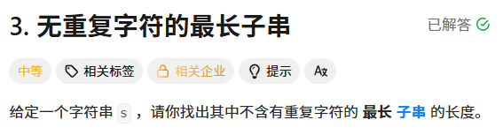
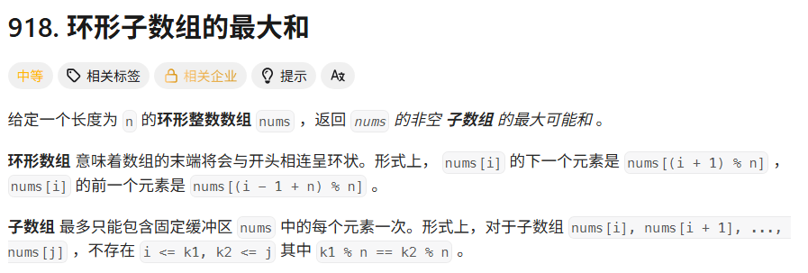
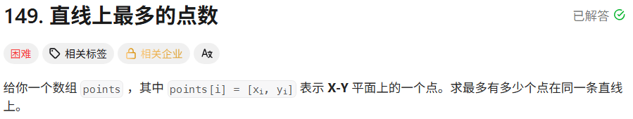
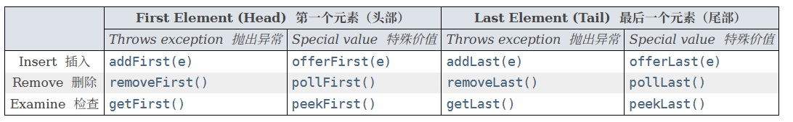
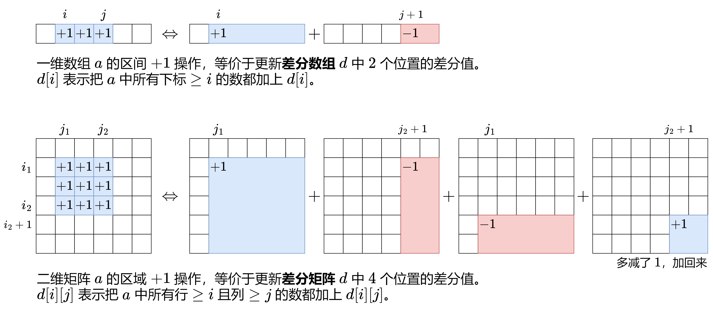
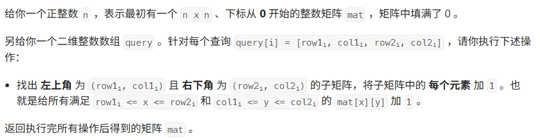

# 一、栈
定义：栈是一种后进先出(FILO/LIFO)的数据结构。

数据结构：
- `Deque<Object> stack = new ArrayDeque<>();`  
- `Deque<Object> stack = new LinkedList<>();`
- `Stack<Object> stack = new Stack<>()`

方法：`E peek(), push(e), E pop()`

<font color="lightblue">提示</font>：栈中的元素可以是值，也可以是指向这个值的索引。

## 1.1 单调栈
### 1.1.1 单调递减栈
定义：栈中存放的是<font color="red">单调递减的元素</font>，栈顶的元素比栈内元素都小。  

代码模板(以int为例)：
```  java
// 数组 int[] nums
int[] nums = new int[] {0,1,0,2,1,0,1,3,2,1,2,1};
Deque<Integer> stack = new ArrayDeque<>();
for (int i = 0; i < nums.length; i++) {
    int x = nums[i];
    while (!stack.isEmpty() && x >= nums[stack.peek()]) {
        int y = stack.pop();
        // 其他内部处理
    }
    stack.push(i);
}
```

题目：
- [T42.接雨水](https://leetcode.cn/problems/trapping-rain-water/description/) 
- [T739. 每日温度](https://leetcode.cn/problems/daily-temperatures/description) 

### 1.1.2 单调递增栈
定义：栈中存放的是<font color="red">单调递增的元素</font>，栈顶的元素比栈内元素都大。

代码模板(以T2054. 两个最好的不重叠活动为例)：
```java
public int maxTwoEvents(int[][] events) {  
    Arrays.sort(events, (a, b) -> a[1] - b[1]);  
    int res = 0;  
    // st 存储{end, value}  
    List<int[]> st = new ArrayList<>();  
    st.add(new int[] {0, 0}); // 哨兵  
    for(int[] e: events) {  
        int start = e[0];  
        int value = e[2];  
        int end = e[1];  
        int i = search(st, start);  
        res = Math.max(res, value + st.get(i)[1]);  
        // 价值高要入栈(保证栈顶元素价值永远最大)  
        if(value > st.getLast()[1]) {  
            st.add(i + 1, new int[] {end, value});  
        }  
    }  
    return res;  
}  
// 开区间二分查找(< target -> return l  >= target -> return r)
private int search(List<int[]> st, int start) {  
    // search the first i make st[i][0] < target  
    int l = -1, r = st.size();  
    while(l + 1 < r) {  
        int m = l + (r - l) / 2;  
        if(st.get(m)[0] >= start) {  
            r = m;  
        }else {  
            l = m;  
        }  
    }  
    return l;  
}
```

题目：
- [T2054. 两个最好的不重叠活动](https://leetcode.cn/problems/two-best-non-overlapping-events/description/) 
- [T84. 柱状图中最大的矩形](https://leetcode.cn/problems/largest-rectangle-in-histogram/) 

# 二、双指针
定义：用两个指针指向数组元素，移动指针，寻找满足条件的元素。

## 2.1 快慢指针
快慢指针：快指针每次移动两步，慢指针每次移动一步，当快慢指针相遇时，慢指针所在位置就是结果。  
场景：常用于寻找链表环的入口或者判断链表有没有环。

代码模板(以T142. 环形链表II为例)：
```java
public ListNode detectCycle(ListNode head) {
	ListNode slow = head, fast = head;
	while(fast != null && fast.next != null) {
		slow = slow.next;
		fast = fast.next.next;
		if(slow == fast) {
			// 此时表示有环，节点为u
			// 数推导知道 head -> u 等于 slow -> u
			fast = head;
			while(slow != fast) {
				fast = fast.next;
				slow = slow.next;
			}
			return slow;
		}
	}
	return null;
}
```

题目：

## 2.2 同向双指针
定义：两个指针同时移动，一个指针比另一个指针先移动，寻找满足条件结果。  

代码模板(以T3. 无重复的最长字串)：

```java
public int lengthOfLongestSubstring(String s) {
	char[] chs = s.toCharArray();
	int n = chs.length;
	int res = 0;
	int[] cnt = new int[128];
	// s[i,j]表示子串
	int overload = 0;
	for(int i = 0, j = 0;j < n;++j) {
		while(cnt[chs[j]] > 0) {
			cnt[chs[i]]--;
			i++;
		}
		cnt[chs[j]]++;
		res = Math.max(res, j - i + 1);
	}
	return res;
}
```

题目：
- [T283. 移动零](https://leetcode.cn/problems/move-zeroes/description) 
- [T15. 三数之和](https://leetcode.cn/problems/3sum/description/) 

## 2.3 相向双指针
定义：两个指针分别指向数组的头和尾，通过移动指针，寻找满足条件结果。

代码模板(以T42. 接雨水为例)：
```java
/**
 * T42.接雨水
 * @param height 柱子高度
 * @return 可以接的雨水量
 */
public int trap(int[] height) {
    int n = height.length, res = 0;
    int l = 0, r = n - 1;
    int preMax = 0, sufMax = 0;
    while(l < r) {
        int hL = height[l], hR = height[r];
        preMax = Math.max(preMax, hL);
        sufMax = Math.max(sufMax, hR);
        // 谁小谁先移动
        if(preMax  < sufMax){
            res += preMax - hL;
            l++;
        }else{
            res += sufMax - hR;
            r--;
        }
    }
    return res;
}
```

题目：
- [T42.接雨水](https://leetcode.cn/problems/trapping-rain-water/description/)


# 三、回溯
定义：使用递归，配合剪枝并恢复现场得到所有结果。通常需要配合剪枝。

代码模板(以括号生成为例):
```java
private void dfs(int left, int right, StringBuilder sb, int n){
    // 剪枝
    if(left > n || right > n) return;
    // 满足条件
    if(left + right == 2 * n) {
        // res定义为全局即可
        res.add(sb.toString());
    }
    if(left < n){
        sb.append("(");
        // 递归
        dfs(left + 1, right, sb, n);
        // 恢复现场
        sb.deleteCharAt(sb.length() - 1);
    }
    if(right < left){
        sb.append(")");
        // 递归
        dfs(left, right + 1, sb, n);
        // 恢复现场
        sb.deleteCharAt(sb.length() - 1);
    }
}
```

题目:  
- [T22. 括号生成](https://leetcode.cn/problems/generate-parentheses/description/) 
- [T77. 组合](https://leetcode.cn/problems/combinations/description/) 

# 四、动态规划
定义：通过递推公式，将问题转化为子问题，得到结果。

注：要学会寻找<font color="lightblue">状态转移机(DP)</font>

## 4.1 DP类型
### 4.1.1 一维DP
定义：一维DP数组，`dp[i]`表示组成i所需要的最小硬币数。

代码模板(以T322.零钱兑换为例):
```java
public int coinChange(int[] coins, int amount) {
    int[] dp = new int[amount + 1];
    Arrays.fill(dp, amount + 1);
    int n = coins.length;
    dp[0] = 0;
    for(int i = 1;i <= amount;++i) {
        for(int c: coins){
            if(i - c < 0) continue;
            // 递推公式
            dp[i] = Math.min(dp[i], dp[i - c] + 1);
        }
    }
    return dp[amount] < amount + 1 ? dp[amount] : -1; 
}
```

题目:
- [T322.零钱兑换](https://leetcode.cn/problems/coin-change/description/) 
- [T960.删序造列III](problem/T960.删列造序III.md) 

### 4.1.2 多维DP
代码模板(以T.188 买卖股票的最佳时机IV)：

```java
public int maxProfit(int k, int[] prices) {
    int n = prices.length;
    // f[i][j][0] 表示第i天交易j次未持有股票
    // f[i][j][1] 表示第i天交易k次持有股票
    /*
    Q: 为啥是k+2
    A: 实际上是把f[i][0][status]作为哨兵了
       实际f[i+1][j][status]表示第i天第j-1笔交易出于status状态时的最大利润
    */
    int[][][] f = new int[n+1][k+2][2];
    // 设置非法值
    for(int[][] mat: f) {
        for(int[] row: mat) {
            Arrays.fill(row, -3000);
        }
    }
    // 设置初始值
    for(int j = 1;j <= k+1;++j) {
        f[0][j][0] = 0;
    }
    for(int i = 0;i < n;++i) {
        for(int j = 1;j <= k+1;++j) {
            // 要么与昨天保持一致，要么在昨天的基础上卖出股票
            // 卖出股票，交易次数不变(写在了买入)
            f[i+1][j][0] = Math.max(f[i][j][0], f[i][j][1] + prices[i]);
            // 要么与昨天保持一致，要么在昨天的基础上买入股票
            // 购买股票，交易次数要+1
            f[i+1][j][1] = Math.max(f[i][j][1], f[i][j-1][0] - prices[i]);
        }
    }
    return f[n][k+1][0];
}

// 优化空间复杂度(同01背包一样需要逆序遍历)
public int maxProfit(int k, int[] prices) {
    int n = prices.length;
    // f[i][j][0] 表示第i天交易j次未持有股票
    // f[i][j][1] 表示第i天交易k次持有股票
    int[][] f = new int[k+2][2];
    for(int j = 1;j <= k + 1;++j) {
	    f[j][1] = -3000;
    }
    f[0][0] = -3000;
    for(int p: prices) {
        for(int j = k+1;j > 0;--j) {
            // 要么与昨天保持一致，要么在昨天的基础上卖出股票
            // 卖出股票，交易次数不变(写在了买入)
            f[j][0] = Math.max(f[j][0], f[j][1] + p);
            // 要么与昨天保持一致，要么在昨天的基础上买入股票
            // 购买股票，交易次数要+1
            f[j][1] = Math.max(f[j][1], f[j-1][0] - p);
        }
    }
    return f[k+1][0];
}
```

题目：
- [T1458. 两个子序列的最大点积](https://leetcode.cn/problems/max-dot-product-of-two-subsequences/description) 

### 4.1.3 多次DP
<font color="red">注：</font>学会理解 <font color="lightblue">"正难则反"</font> 思想

代码模板：

```java
// 直接计算最大值maxS，此时只要数组没跨界就正确
// 当数组跨界的时候只需要计算minS，这个必然不跨界
// 所以两者只需要求max(maxS, sum - minS)
// 特例：当数组全部小于0，此时会有maxS<0而sum-minS=0
// 因此特里需要特殊处理
public int maxSubarraySumCircular(int[] nums) {
	int sum = 0;
	// maxS和minS记录最大或最小子数组和
	int maxS = Integer.MIN_VALUE;
	int minS = 0;
	// maxF和minF是动态规划单个变量
	int maxF = 0, minF = 0;
	for(int x: nums) {
		sum += x;
		maxF = Math.max(maxF, 0) + x;
		maxS = Math.max(maxS, maxF);
		minF = Math.min(minF, 0) + x;
		minS = Math.min(minF, minS);
	}
	// maxS < 0 表示数组全部都是负数，sum-minS和maxS求最大值会出错，直接单独处理
	if(maxS < 0) {
		return maxS;
	}
	return Math.max(maxS, sum - minS);
}
```

### 4.1.4 树形DP(书上背包)
题目：
- [P1352没有上司的舞会](problem/P1352没有上司的舞会.md): 出自洛谷
- [T3562.折扣价交易股票的最大利润](problem/T3562.折扣价交易股票的最大利润.md) 

### 4.1.5 数位DP
代码模板：
```java
// 代码示例：返回 [low, high] 中的恰好包含 target 个 0 的数字个数
// 比如 digitDP(0, 10, 1) == 2
// 要点：我们统计的是 0 的个数，需要区分【前导零】和【数字中的零】，前导零不能计入，而数字中的零需要计入
class Solution {
    public long digitDP(int low, int high, int target) {
        char[] lowS = String.valueOf(low).toCharArray();
        char[] highS = String.valueOf(high).toCharArray();
        
        int n = highS.length;
        long[][] memo = new long[n][target + 1];
        for(long[] row: memo) {
            Arrays.fill(row, -1);
        }
        return dfs(0, 0, true, true, lowS, highS, target, memo);
    }
    private long dfs(int i, int cnt0, boolean limitLow, boolean limitHigh, char[] lowS, char[] highS, int target, long[][] memo) { 
        if(cnt0 > target) {
            // 不合法
            return 0;
        }
        if(i == highS.length) {
            return cnt0 == target ? 1 : 0;
        }
        if(!limitLow && !limitHigh && memo[i][cnt0] >= 0) {
            return memo[i][cnt0];
        }
        int diff = highS.length - lowS.length;
        // 如果还没到 low 开始的位数，下界视为 0
        int lo = limitLow && i >= diff ? lowS[i - diff] - '0' : 0;
        // 上界受 limitHigh 限制
        int hi = limitHigh ? highS[i] - '0' : 9;
        
        long res = 0;
        int d = lo;
        // 通过 limitLow 和 i 可以判断能否不填数字，无需 isNum 参数
        // 如果前导零不影响答案，去掉这个 if block
        if(limitLow && i < diff) {
            res = dfs(i + 1, cnt0, true, false, lowS, highS, target, memo);
            d = 1;
        }
        
        for(;d <= hi;++d) {
            res += dfs(i + 1,
                    cnt0 + (d == 0 ? 1 : 0),
                    limitLow && d == lo,
                    limitHigh && d == hi,
                    lowS, highS, target, memo);
        }
        if(!limitLow && !limitHigh) {
            memo[i][cnt0] = res;
        }
        return res;
    }
}
```


## 4.2 背包问题


# 五、图
定义：图是一组节点和边组成的数据结构。

两种表示形式：
- 邻接矩阵：`int[][]`
- 邻接表1：`List<Integer>[]`
- 邻接表2：`Map<Integer, List<Integer>>`

注：邻接表2构图较为特殊，使用 <font color="#b2a2c7">Map</font> 的 <font color="#92cddc">computeIfAbsent</font>   
写法：`g.computeIfAbsent(u, k -> new ArrayList<>()).add(v)` 

## 5.1 遍历方式
两种遍历方式：
- DFS: 深度优先搜索
- BFS: 广度优先搜索

### 5.1.1 DFS
代码模板(以T200.岛屿数量为例):  
```java
private int m, n;
    private static final int[][] DIRS = {{-1, 0}, {0, 1}, {1, 0}, {0, -1}};
    public int numIslands(char[][] grid) {
        int m = grid.length, n = grid[0].length;
        this.m = m;
        this.n = n;
        int res = 0;
        for(int i = 0;i < m;++i){
            for(int j = 0;j < n;++j){
                if(grid[i][j] == '1') {
                    res++;
                    // 深度优先搜索
                    dfs(grid, i, j);
                }
            }
        }
        return res;
    }

    private void dfs(char[][] g, int i, int j){
        if(i < 0 || i >= m || j < 0 || j >= n) return ;
        if(g[i][j] != '1') return ;
        g[i][j] = '2';
        for(int[] d: DIRS){
            int x = i + d[0], y = j + d[1];
            // 递归
            dfs(g, x, y);
        }
    }
```

### 5.1.2 BFS


## 5.2 拓扑排序
定义：拓扑排序，可以判断一个有向图是否存在环  

基本代码模板(以T207.课程表为例):  
```java
public boolean canFinish(int numCourses, int[][] prerequisites) {
    // 创建图的邻接表
    List<Integer>[] graph = new ArrayList[numCourses];
    Arrays.setAll(graph, i -> new ArrayList<>());
    // 图的每个节点的入度
    int[] inDegree = new int[numCourses];
    for(int[] e: prerequisites) {
        // 计算入度
        inDegree[e[0]]++;
        // 添加邻接节点
        graph[e[1]].add(e[0]);
    }
    int[] queue = new int[numCourses];
    // [front, rear)
    int front = 0, rear = 0;  
    // 添加入度为0的节点
    for(int i = 0;i < numCourses;++i) {
        if(inDegree[i] == 0) {
            queue[rear++] = i;
        }
    }
    // 还有多少个点没访问
    int n = numCourses;
    while(front < rear) {
        // 出队
        int cur = queue[front++];
        n--;
        for(int nxt: graph[cur]) {
            // 删边，并判断删除边之后是否满足入度为0
            if(--inDegree[nxt] == 0) {
                // 入度为0的节点入队
                queue[rear++] = nxt;
            }
        }
    }
    return n == 0;
}
```

题目：
- [T210.课程表II](https://leetcode.cn/problems/course-schedule-ii) 

# 六、二分查找
定义：二分查找，通过不断缩小范围，找到目标元素。

基本代码模板(开区间写法)：
```java
// nums[idx] >= target
// 学会转化为查找第一个大于等于target的idx
private int binarySearch(int[] nums, int target) {
    int l = -1, r = nums.length;
    while(l + 1 < r) {
        int m = l + (r - l) >> 1;
        // 根据红蓝染色可以知道[r, nums.length)区间的值一定大于等于target
        if(nums[m] >= target) r = m;
        else l = m;
    }
    return r;
}
```

## 6.1 基础二分查找
定义：给定一个数组，查找一个数，返回索引。  

代码模板见基本代码模板。

题目：

## 6.2 数值二分查找
定义：通过直接在数值区间进行二分。  

题目：
- [T4. 寻找两个正序数组的中位数](problem/T4.寻找两个正序数组的中位数.md) 


# 七、树
定义：树是一类无向图，其中任意两个顶点之间至多存在一条路径。  

二叉树四种遍历方式：
- 先序遍历
- 中序遍历
- 后序遍历
- 层序遍历

## 7.1 四种遍历方式模板
### 7.1.1 先序遍历
递归模板：
```java
public void recursivePreorderTraversal(TreeNode root) { 
    
}
```


迭代模板：
```java
public void iterativePreorderTraversal(TreeNode root) { 
    
}
```


morris遍历模板(将空间复杂度降为O(1)的迭代遍历)：
```java
public void morrisPreorderTraversal(TreeNode root) { 
    
}
```


### 7.1.2 中序遍历
递归模板：
```java
public void recursiveInorderTraversal(TreeNode root) { 
    List<Integer> res = new ArrayList<>();
    inorder(root, res);
    return res;
}

private void inorder(TreeNode node, List<Integer> res) {
	if(node == null) return ;
	inorder(node.left);
	res.add(node.val);
	inorder(node.right);
}
```


迭代模板：
```java
public void iterativeInorderTraversal(TreeNode root) { 
    List<Integer> res = new ArrayList<>();
    
    Deque<TreeNode> st = new ArrayDeque<>();
    while(root != null || !st.isEmpty()) {
		while(root != null) {
			st.push(root);
			root = root.left;
		}
		root = st.pop();
		res.add(root.val);
		root = root.right;
	}
    
    return res;
}
```


morris遍历模板(将空间复杂度降为O(1)的迭代遍历)：
```java
public void morrisInorderTraversal(TreeNode root) { 
    List<Integer> res = new ArrayList<>();
    
    TreeNode predecessor = null;
    while(root != null) {
	    if(root.left != null) {
		    predecessor = root.left;
		    // 寻找 root 左子树的最右边节点
		    while(predecessor.right != null && predecessor.right != root) {
			    predecessor = predecessor.right;
		    }
		    if(predecessor.right == null) {
			    // 第一次遍历到这个点 建立连接(下一个点为root)
			    predecessor.right = root;
			    // 重复处理root.left的左子树
			    root = root.left;
		    }else {
			    // 第二次遍历这个点需要恢复连接
			    predecessor.right = null;
			    res.add(root.val);
			    root = root.right;
		    }
	    }else {
		    res.add(root.val);
		    root = root.right;
	    }
    }
    
    return res;
}
```


### 7.1.3 后序遍历
递归模板：
```java
public void recursivePostorderTraversal(TreeNode root) { 
    
}
```


迭代模板：
```java
public void iterativePostorderTraversal(TreeNode root) { 
    
}
```


morris遍历模板(将空间复杂度降为O(1)的迭代遍历)：
```java
public void morrisPostorderTraversal(TreeNode root) { 
    
}
```

题目(后续遍历思想)：
- [T1123. 最深叶节点的最近公共祖先](./problem/T1123.最深叶节点的最近公共祖先.md) 

### 7.1.4 层序遍历
基本代码块：
```java
public List<List<Integer>> levelOrder(TreeNode root) {
    List<List<Integer>> res = new ArrayList<>();
    if(root == null) return res;
    // 使用List模拟队列
    List<TreeNode> queue = new ArrayList<>();
    queue.add(root);
    while(!queue.isEmpty()) { 
        List<Integer> level = new ArrayList<>();
        List<TreeNode> nxt = new ArrayList<>();
        for(TreeNode node: queue) {
            level.add(node.val);
            // 添加下一层的节点
            if(node.left != null) nxt.add(node.left);
            if(node.right != null) nxt.add(node.right);
        }
        // 添加遍历结果
        res.add(level);
        // 更新队列
        queue = nxt;
    }
    return res;
}
```

## 7.2 前缀树/字典树
基本模板：
```java
public class Trie {
    // 这个是一般用于a-z的英文字母字典树
    private static class Node {
        Node[] child = new Node[26];
        boolean isEnd = false;
        // 还可以加一些其他属性, 例如cnt(字符出现组数)
    }
    // 根节点
    private final Node root = new Node();

    public Trie() {}

    public void insert(String word) {
        Node cur = root;
        for(char c: word.toCharArray()){
            int idx = c - 'a';
            if(cur.child[idx] == null) cur.child[idx] = new Node();
            cur = cur.child[idx];
        }
        cur.isEnd = true;
    }
    
    // cur.isEnd = true;
    // 搜索单词
    public boolean search(String word) {
        return find(word) == 2;
    }
    
    // cur.isEnd 无关
    // 搜索前缀
    public boolean startsWith(String prefix) {
        return find(prefix) != 0;
    }

    private int find(String word) {
        Node cur = root;
        for(char c: word.toCharArray()){
            int idx = c - 'a';
            if(cur.child[idx] == null) return 0;
            cur = cur.child[idx];
        }
        return cur.isEnd ? 2 : 1;
    }
}
```

可扩展节点模板：
```java
class Trie {
    private String word;
    private Map<Character, Trie> children;
    private boolean isWord;
    public Trie() {
        word = "";
        children = new HashMap<>();
    }
    public void insert(String word) {
        Trie cur = this;
        for(char c: word.toCharArray()) {
            if(!cur.children.containsKey(c)) {
                cur.children.put(c, new Trie());
            }
            cur = cur.children.get(c);
        }
        cur.word = word;
    }
}
```

## 7.3 线段树/树状数组
[灵神算法之数据结构](https://leetcode.cn/discuss/post/3583665/fen-xiang-gun-ti-dan-chang-yong-shu-ju-j-bvmv/)

### 7.3.1 树状数组

定义：快速地计算任意一段连续子数组的元素和(数组可以时刻变化)，可以做到query和update均为 `O(logn)`。

注：能用树状数组解决的题目，也能用线段树解决（反过来不一定）。但树状数组实现简单，代码短。

代码示例(以求区间和为例)：
```java
// 这里使用的是下表1-n，真实情景注意变换
class FenwickTree {
	// long只是为了更通用，数据小也可以int
	private final long[] tree;
	
	public FenwickTree(long[] nums) {
		// 下标使用 1 ~ n 更好计算
		int n = nums.length;
		tree = new long[n + 1];
		for(int i = 1;i <= n;++i) {
			tree[i] += nums[i - 1];
			// 下一个关键区间右端点
			int nxt = i + (i & -i);
			if(nxt <= n) {
				tree[nxt] += tree[i];
			}
		}
	}
	
	// 更新操作
	// 这里要注意是变成val还是增加val
	// 当 nums[i] 增加 val
	// 1 <= i <= n
	public void update(int i, long val) {
		for(;i < tree.length; i += i & -i) {
			tree[i] += val;
		}
	}
	
	// 求前缀和
	// sum[1, i]
	public long pre(int i) {
		long res = 0;
		for(;i > 0; i &= i - 1) {
			res += tree[i];
		}
		return res;
	}
	
	// 求区间和
	// sum[left, right]
	// 1 <= left <= right <= n
	public long query(int left, int right) {
		return pre(right) - pre(left - 1);
	}
}
```

题目：
- [T3777. 使子字符串变交替的最少删除次数](https://leetcode.cn/problems/minimum-deletions-to-make-alternating-substring/) 
- 

### 7.3.2 线段树(无区间更新)
定义：把任意区间用 `O(logn)` 个区间表示，线段树的每个节点记录对应区间的信息。
- 询问：把询问区间拆分成 `O(logn)` 个区间，对应着线段树的 `O(logn)` 个节点，把这 `O(logn)` 个节点的信息合并，即为答案。
- 单点更新：有 `O(logn)` 个区间包含被修改的位置，需要更新 `O(logn)` 个节点的信息。

代码：
```java
class SegmentTree {
    private final int n;
    // long是为了更通用，数据小也可以int
    private final long[] tree;
    
    // 线段树是为了维护一个初始长度为n（0~n-1）的数组，初始值设为initVal
    public SegmentTree(int n, long initVal) {
        this.n = n;
        long[] a = new long[n];
        Arrays.fill(a, initVal);
        // 开辟线段树节点数(可以直接4n，也可以如下，可以减少节点数)
        tree = new long[2 << (32 - Integer.numberOfLeadingZeros(n - 1))];
        // 构建线段树
        build(a, 1, 0, n - 1);
    }
    
    // 初始化也可以直接维护那个给定数组
    public SegmentTree(long[] a) {
        n = a.length;
        tree = new long[2 << (32 - Integer.numberOfLeadingZeros(n - 1))];
        build(a, 1, 0, n - 1);
    }
    
    // 合并两个val
    private long mergeVal(long a, long b) {
        // TODO 这里需要根据题目修改这个合并逻辑(max, min, sum...)
        return Math.max(a, b);
    }
    
    // 合并左右儿子的val到当前节点val
    private void maintain(int node) {
        // 左儿子：2 * node
        // 右儿子：2 * node + 1
        tree[node] = mergeVal(tree[node << 1], tree[node << 1 | 1]);
    }
    
    // 构建线段树a[l,r], node表示当前树节点
    private void build(long[] a, int node, int l, int r){
        if(l == r) {
            // 叶子节点
            tree[node] = a[l];
            return;
        }
        // 递归构造tree
        int m = (l + r) / 2;
        // 左子树 node * 2
        build(a, node << 1, l, m);
        // 右子树 node * 2 + 1
        build(a, node << 1 | 1, m + 1, r);
        // tree[node] = mergeVal(tree[node * 2], tree[node * 2 + 1])
        maintain(node);
    }
    
    // 更新线段树
    private void update(int node, int l, int r, int i, long val){
        if(l == r) {
            // 找到了i节点，叶子节点，a[i] = val;
            // TODO 这里视情况而变
            tree[node] = val;
            return ;
        }
        int m = (l + r) / 2;
        if(i <= m) {
            // 在左子树
            update(node << 1, l, m, i, val);
        }else {
            // 在右子树
            update(node << 1 | 1, m + 1, r, i, val);
        }
        // 维护 node 节点 tree[node] = mergeVal(tree[node * 2], tree[node * 2 + 1])
        maintain(node);
    }
    
    // 查询区间[ql, qr]的值
    private long query(int node, int l, int r, int ql, int qr) {
        if(ql <= l && r <= qr) {
            // 区间[ql, qr]大于等于[l, r]
            return tree[node];
        }
        int m = (l + r) / 2;
        // 完全在左子树
        if(qr <= m) {
            return query(node << 1, l, m, ql, qr);
        }
        // 完全在右子树
        if(ql > m) {
            return query(node << 1 | 1, m + 1, r, ql, qr);
        }
        // 此时表明ql <= m < qr
        long leftRes = query(node << 1, l, m, ql, qr);
        long rightRes = query(node << 1 | 1, m + 1, r, ql, qr);
        return mergeVal(leftRes, rightRes);
    }
    
    // 对外开放接口 update, get, query
    // 更新 a[i] 为 val
    public void update(int i, long val) {
        update(1, 0, n-1, i, val);
    }
    
    // 获取 a[i] 的值
    public long get(int i) {
        return query(1, 0, n-1, i, i);
    }
    
    // 查询区间 [left, right] 的值
    public long query(int left, int right) {
        return query(1, 0, n-1, left, right);
    }
}
```

### 7.3.3 Lazy线段树(有区间更新)
把任意区间用 $O(logn)$ 个区间表示，线段树的每个节点记录对应区间的信息。
- 询问：把询问区间拆分成 $O(logn)$ 个区间，对应着线段树的 $O(logn)$ 个节点，把这 $O(logn)$ 个节点的信息合并，即为答案。
- 区间更新：仍然是拆分成 $O(logn)$ 个区间，对应着线段树的 $O(logn)$ 个节点。但对于其中的非叶节点，不把更新的内容往下传递给子节点，而是记录「发生了更新，内容为 xxx」，把更新的内容记录下来。直到后续的询问或更新操作，需要访问或修改更下面的子节点信息时，才把更新的内容往下传。

代码模板：
```java
class LazySegmentTree {
	// TODO 根据题目修改
	private static final long TODO_INIT = 0;
    
    private final int n;
    private final Node[] tree;
	
	private static final class Node {
		// 根据题目修改
		long val;
		long todo;
	}   
    
    // 维护一个数组长度为 n 且初始值为 initVal 的数组
    public LazySegmentTree(int n, long initVal) {
        this.n = n;
        long[] a = new long[n];
        Arrays.fill(a, initVal);
        tree = new Node[2 << (32 - Integer.numberOfLeadingZeros(n - 1))];
        build(a, 1, 0, n-1);
    }
    
    // 线段树维护数组 a
    public LazySegmentTree(long[] a) {
        n = a.length;
        tree = new Node[2 << (32 - Integer.numberOfLeadingZeros(n - 1))];
        build(a, 1, 0, n-1);
    }
	
	// 合并两个val
	private long mergeVal(long a, long b) {
		// TODO 根据题目修改
		return a + b;
	}
	
	// 合并两个懒标记
	private long mergeTodo(long a, long b) {
		// TODO 根据题目修改
		return a + b;
	}
    
    // 把懒标记作用到 node 子树 (模板操作是区间加)
    private void apply(int node, int l, int r, long todo) { 
        Node cur = tree[node];
        // 根据题目修改
        cur.val += todo * (r - l + 1);
        cur.todo = mergeTodo(cur.todo, todo);
    }
    
    // 把当前节点的懒标记下传给左右儿子
    private void spread(int node, int l, int r) {
        long todo = tree[node].todo;
        if(todo == TODO_INIT) {
            return ;
        }
        int m = (l + r) / 2;
        apply(node * 2, l, m, todo);
        apply(node * 2 + 1, m + 1, r, todo);
        tree[node].todo = TODO_INIT;
    }
    
    private void maintain(int node) {
        tree[node].val = mergeVal(tree[node * 2].val, tree[node * 2 + 1].val);
    }
    
    // 使用数组 a 构建线段树  O(n)
    private void build(long[] a, int node, int l, int r) {
        tree[node] = new Node();
        tree[node].todo = TODO_INIT;
        if(l == r) {
            // 叶子节点
            tree[node].val = a[l];
            return ;
        }
        int m = (l + r) / 2;
        build(a, node * 2, l, m);
        build(a, node * 2 + 1, m + 1, r);
        maintain(node);
    }
    
    // 线段树更新区间 [ql, qr] 的值
    private void update(int node, int l, int r, int ql, int qr, long f) {
        if(ql <= l && r <= qr) {
            apply(node, l, r, f);
            return ;
        }
        spread(node, l, r);
        int m = (l + r) / 2;
        if(ql <= m) {
            update(node * 2, l, m, ql, qr, f);
        }
        if(qr > m) {
            update(node * 2 + 1, m + 1, r, ql, qr,f);
        }
    }
    
    private long query(int node, int l, int r, int ql, int qr) {
        if(ql <= r && l <= qr) {
            return tree[node].val;
        }
        spread(node, l, r);
        int m = (r + l) / 2;
        if(qr <= m) {
            return query(node * 2, l, m, ql, qr);
        }
        if(ql > m) {
            return query(node * 2 + 1, m + 1, r, ql, qr);
        }
        long lRes = query(node * 2, l, m, ql, qr);
        long rRes = query(node * 2 + 1, m + 1, r, ql, qr);
        return mergeVal(lRes, rRes);
    }
    
    // 开放 api
    // 返回用 mergeVal 合并所有 a[i] 的计算结果，其中 i 在闭区间 [ql, qr] 中
    // 0 <= ql <= qr <= n-1
    // 时间复杂度 O(log n)
    public long query(int ql, int qr) {
        return query(1, 0, n-1, ql, qr);
    }
    
    // 用 f 更新 [ql, qr] 中的每个 a[i]
    // 0 <= ql <= qr <= n-1
    // 时间复杂度 O(log n)
    public void update(int ql, int qr, long f) {
        update(1, 0, n-1, ql, qr, f);
    }
} 
```


### 7.3.4 ST表
ST表支持 <font color="#ff0000">区间最值查询</font> ，但不能修改。  
优点：代码短且查询时间为 $O(1)$ 


## 7.4 最近公共祖先(LCA)
代码模板：

```java
import java.util.ArrayList;
import java.util.Arrays;

// 这里以带权树为例，无权树直接用depth就可以 
// 节点编号从 0 开始
class LcaBinaryLifting {
    private final int[] depth;
    private final long[] dis;
    // pa[i][x] 表示 x 的第 2^i 个祖先节点
    // pa[0][x] 表示 x 的父节点
    // pa[1][x] = pa[0][pa[x][0]] 表示爷爷节点
    private final int[][] pa;

    public LcaBinaryLifting(int[][] edges) {
        int n = edges.legnth + 1;
        int m = 32 - Integer.numberOfLeadingZeros(n);
        List<int[]>[] g = new ArrayList[n];
        Arrays.setAll(g, i -> new ArrayList<>());
        for(int[] e: edges) {
            int x = e[0], y = e[1], w = e[2];
            g[x].add(new int[]{y, w});
            g[y].add(new int[]{x, w});
        }
        
        depth = new int[n];
        dis = new long[n];
        // pa[m][n]是为了预处理的时候由于内存访问模式可以连续访问，速度更快
        pa = new int[m][n];
        
        // 以 0 为根节点
        dfs(g, 0, -1);
        
        // 原理： x 的第 2^{i+1} 个祖先，就是 x 的第 2^i 个祖先的第 2^i 个祖先
        // Q: 为什么是 i < m - 1 ?
        // A: 因为只需要计算[1, m-1]即可，0以及初始化了
        for(int i = 0;i < m - 1;++i) {
            for(int x = 0;x < n;++x) {
                // 节点 0 的父节点设为了 -1
                int p = pa[i][x];
                // 所以pa[i][x] < 0 表示 x 没有第 2^i 个祖先
                pa[i + 1][x] = p < 0 ? -1 : pa[i][p];
            }
        }
    }
    // 设置父节点和计算 depth和 dis
    private void dfs(List<int[]>[] g, int x, int fa) {
        pa[0][x] = fa;
        for(int[] e: g[x]) {
            int y = e[0], w = e[1];
            if(y != fa) {
                depth[y] = depth[x] + 1;
                dis[y] = dis[x] + w;
                dfs(g, y, x);
            }
        }
    }
    
    public int getKthAncestor(int node, int k) {
        for(;k > 0 && node >= 0; k &= k - 1) {
            node = pa[Integer.numberOfTrailingZeros(k)][node];
        }
        return node;
    }
    // 返回 x 和 y 的最近公共祖先(编号从0开始)
    public int getLCA(int x, int y) {
        if(depth[x] > depth[y]) {
            int t = x;
            x = y;
            y = t;
        }
        y = getKthAncestor(y, depth[y] - depth[x]);
        if(x == y) {
            return x;
        }
        // 这里的思想很巧妙，优点类似贪心，先往大了跳
        // 因为后续要跳的步数一定小于当前跳的步数，如果从小往大的话就不好操作了
        for(int i = pa.length - 1;i >= 0;--i) {
            int px = pa[i][x], py = pa[i][y];
            if(px != py) {
                // 同时往上跳 2^i 步
                x = px;
                y = py;
            }
        }
        // 跳到最后一定是当前 x 或者 y 的父亲就是最近的公共祖先
        return pa[0][x];
    }
    // 返回 x 和 y 的距离(最短长度)
    public long getDis(int x, int y) {
        return dis[x] + dis[y] - 2 * dis[getLCA(x, y)];
    }
}
```

# 八、哈希表与集合
## 8.1 哈希表 
定义：哈希表是一种数据结构，用于存储键值对。

常见的Map结构：Map(不可以new), HashMap

常用方法：
- `V get(K key): 获取key对应的值`
- `V getOrDefault(K key, V defaultValue): 获取key对应的值, 如果key不存在则返回defaultValue`
- `V put(K key, V value): 添加键值对, 返回旧值`
- `V remove(K key): 删除key对应的键值对`
- `size(), isEmpty(), containsKey(K, key)`
- `V merge(K, V, BiFunction<V, V, V>): 合并key对应的值, 返回合并后的值(新值)`
- `static <K, V> Map<K, V> of(K k1, V v1, K k2, V v2, ...): 创建一个只包含指定键值对的Map（最多10个键值对）`
- `V computeIfAbsent(K key, Function<? super K, ? extends V> func)`：如果指定的键尚未与值关联（或映射到`null`），则尝试使用给定的映射函数计算其值，并将其输入到此映射中，除非`为 null`。

Q: 什么时候可以用Double当key？
A: 最大最小值差值不超过 ==6.7 * 10^7== 

代码模板（以T149. 直线上最多的点数为例）：

```java
public int maxPoints(int[][] points) {
	int n = points.length, res = 0;
	for(int i = 0;i < n - 1;++i) {
		// 点P
		int[] p = points[i];
		// 避免重复计算
		// 斜率k为键，值为斜率相当的数量
		// map放在外层的话会重复累加，应当放里面固定一个点来避免重复叠加
		Map<Double, Integer> cnt = new HashMap<>();
		for(int j = i + 1;j < n;++j) {
			// 点Q
			int[] q = points[j];
			int dx = q[0] - p[0];
			int dy = q[1] - p[1];
			// dx等于0的时斜率为+∞
			double k = dx != 0 ? (double) dy / dx : Double.POSITIVE_INFINITY;
			// Double中-0.0 != 0.0, 需要特殊处理
			if(k == 0) k = 0;
			int c = cnt.merge(k, 1, Integer::sum);
			res = Math.max(res, c);
		}
	}
	// 由于点数应当比斜率数多1
	return res + 1;
}
```

## 8.2 集合
### 8.2.1 普通集合(Set)
集合：常用于去重或者标记

常用方法：
- `Map.of()`
- `add(), addAll()`
- `contains(), containsAll()`
- `isEmpty(), size()`
- `remove(), removeAll(), clear()`

### 8.2.2 并查集(UnionFind)
#### 普通并查集
代码模板：
```java
class UnionFind{
    private final int[] fa;  // 代表元
    private final int[] size; // 集合大小
    public int cc; // 连通块个数
    public UnionFind(int n) { 
        // 一开始有 n 个集合 {0}, {1}, ... , {n-1}
        // 集合 i 的代表元初始化为自己，结合大小为1，连通块个数为n
        fa = new int[n];
        size = new int[n];
        for(int i = 0;i < n;++i) {
            fa[i] = i;
        }
        Arrays.fill(size, 1);
        cc = n;
    }
    // 寻找 x 所在集合的代表元
    // 这里最好做路径压缩，后续寻找更快
    public int find(int x) {
        // fa[x] == x 表示 x 的代表元就是fa[x]
        if(fa[x] != x) {
            // 这里进行修改代表元从而实现路径压缩
            fa[x] = find(fa[x]);
        }
        return fa[x];
    }

    /**
     * 判断 x 和 y 是否在同一个集合中
     * @return true 表示 x 和 y 在同一个集合中
     */
    public boolean isSame(int x, int y) {
        // 从这里就知道了代表元的作用就是快速判断 x 和 y 是否在同一个集合中
        return find(x) == find(y);
    }
    /**
     * 合并 from 和 to 所在的集合
     * @return 返回值表示是否合并成功
     */
    public boolean union(int from, int to) {
        int x = find(from);
        int y = find(to);
        if(x == y) {
            // from 和 to本身就在一个集合则无需合并
            return false;
        }
        // 这里是吧x集合合并到y集合中
        fa[x] = y;
        // 合并后集合元素大小也需要变
        size[y] += size[x];
        // 无需更新 size[x]，因为我们不用 size[x] 而是用 size[find(x)] 获取集合大小，
        // 但 find(x) == y，我们不会再访问 size[x]
        
        // 合并成功后需要修改联通块个数
        cc--;
        return true;
    }
    
    // 返回 x 所在集合的大小
    public int getSize(int x) {
        // 确保在 x 所在集合的代表元上查找集合大小
        return size[find(x)];
    }
}
```

#### 带权并查集
代码模板：
```java
class UnionFind{
    // 代表元
    private final int[] fa;
    // dis[x] 表示 x 到 x所在集合的代表元的距离
    private final int[] dis;
    
    public UnionFind(int n) {
        // 初始化代表元和距离
        fa = new int[n];
        dis = new int[n];
        for(int i = 0;i < n;++i) {
            fa[i] = i;
        }
    }
    // 寻找 x 代表元并做路径压缩
    public int find(int x) {
        if(fa[x] != x) {
            int root = find(fa[x]);
            fa[x] = root;
            dis[x] += dis[fa[x]];
        }
        return fa[x];
    }
    // 判断是不是同一个集合
    public boolean isSame(int x, int y){
        return find(x) == find(y);
    }
    // 计算 from 到 to 的相对距离
    // 这需要 from 和 to 出于同一个集合
    public int getRelativeDistance(int from, int to) {
        // to - from = (x - from) - (x - to) = dis[from] - dis[to]
        find(from);
        find(to);
        return dis[from] - dis[to];
    }
    // 合并 from 和 to，新增信息 to - from = value
    // 其中 to 和 from 表示未知量，下文的 x 和 y 也表示未知量
    // 如果 from 和 to 不在同一个集合，返回 true，否则返回是否与已知信息矛盾
    public boolean merge(int from, int to, int value) {
        int x = find(from), y = find(to);
        if(x == y) {
            return dis[from] - dis[to] == value;
        }
        // 计算 x 到 y 的距离 y - x
        // y - to = dis[to]
        // x - from = dis[from]
        // y - from = (y - x) + (x - from) = (y - to) + (to - from) 
        // y - x = (to - from) + (y - to) - (x - from)
        dis[x] = value + dis[to] - dis[from];
        fa[x] = y;
        return true;
    }
}
```

题目：
- [T399. 除法求值](Algorithm/problem/T399.除法求值.md) 

# 九、字符串
定义：字符串是一种数据结构，用于存储字符序列。  
<font color="red">注：</font>Java中的字符串是一个不可变的对象，一旦创建，就不能被修改。  

常用方法：
- `int indexOf(String str): 返回str在当前字符串中第一次出现的索引，如果没有则返回-1`

[StringBuilder技巧](../JavaStudy/Java进阶学习/StringBuilder.md) 

题目：
- [T394. 字符产解码](./problem/T394.字符产解码.md) 
## 9.1 字符串匹配(KMP)
定义：KMP 是一个解决模式串在文本串是否出现过，如果出现过，最早出现的位置的经典算法。

代码模板：
```java
public int[] calculateNext(String s) {
	int n = s.length;
	int[] next = new int[n];
	/*
    len有两个作用：
	    1. 用于记录当前子串的最长公共前后缀长度
        2. 同时知道当前子串的最长公共前后缀的前缀字符串对应索引 [0,len)
        3. len表示当前子串最长公共前缀字符串的下一个字符的索引
    */
	int i = 1;
	while(i < n) {
		if(s.charAt(i) == s.charAt(len)) {
			// 相等，拼接公共前缀
			len++;
			next[i] = len;
			i++;
		}else if(len == 0) {
			// 表示[0, i]的不存在公共前缀
			next[i] == 0;
			i++;
		}else{
			len = next[len - 1];
		}
	}
}

public int kmpSearch(String origin, String target) {
	int m = origin.length(), n = target.length();
	int[] next = calculateNext(target);
	int i = 0, j = 0;
	while(i < m && j < n) {
		if(origin.charAt(i) == target.charAt(j)) {
			i++;
			j++;
		}else if(j == 0) {
			// 第一个字符就不匹配
			i++;
		}else {
			j = next[j - 1];
		}
	}
	return j == n ? i - j : -1;
}
```

# 十、队列
定义：队列是一种数据结构，FIFO(先进先出)。

数据结构：
- `Deque<Obejct> queue = new LinkedList<>();`
- `Deque<Object> queue = new ArrayDeque<>();`
- `Queue<Object> queue = new LinkedList<>();`

方法：`boolean offer(e), E poll(), E peek()`

双端队列：`Deque`  
方法： 

## 10.1 优先队列
定义：优先队列其实就是堆，一般默认都是小顶堆。  

数据结构：`PriorityQueue<Obejct> queue = new PriorityQueue<>();`

方法：`boolean offer(e), E poll(), E peek()`

代码模板(以T23.合并k个升序链表为例):
```java
public ListNode mergeKLists(ListNode[] lists) {
        if(lists == null || lists.length == 0) return null;
        int n = lists.length;
        if(n == 1) return lists[0];
        // 创建小根堆
        PriorityQueue<ListNode> queue = new PriorityQueue<>(n, (a, b) -> a.val - b.val);
        for(ListNode node: lists) {
            if(node != null) {
                queue.offer(node);
            }
        }
        ListNode dummy = new ListNode(), pre = dummy;
    while(!queue.isEmpty()) {
        ListNode node = queue.poll();
        if(node.next != null) queue.offer(node.next);
        pre.next = node;
        pre = node;
    }
        return dummy.next;
    }
```

## 10.2 单调队列
### 10.2.1 单调递减队列
代码模板
```java
public int[] maxSlidingWindow(int[] nums, int k) {
    int n = nums.length;
    int[] res = new int[n - k + 1];
    Deque<Integer> dq = new ArrayDeque<>();
    for(int i = 0;i < n;++i) {
        while(!dq.isEmpty() && dq.peekLast() < nums[i]) {
            dq.pollLast();
        }
        dq.offerLast(nums[i]);
        int left = i - k + 1;
        if(left >= 0) {
            res[left] = dq.peekFirst();
            if(dq.peekFirst() == nums[left]) {
                dq.pollFirst();
            }
        }
    }
    return res;
}
```

### 10.2.2 单调递增队列
代码模板：
```java

```

# 十一、滑动窗口
定义：滑动窗口是一种数据结构，用于维护一个窗口，窗口大小为k，窗口内元素为[i, i+k-1]。

## 11.1 定长滑动窗口
定义：定长滑动窗口，窗口大小为k，窗口内元素为[i, i+k-1]。

代码模板(以T30.串联所有单词的子串为例)：
```java
// 学会理解overload的思想
public List<Integer> findSubstring(String s, String[] words) {
        List<Integer> res = new ArrayList<>();
        int wordLen = words[0].length(), n = s.length();
        int windowLen = wordLen * words.length;
        Map<String, Integer> targetCnt = new HashMap<>();
        for(String word: words) targetCnt.merge(word, 1, Integer::sum);
        // wordLen次定长滑动窗口
        for(int start = 0;start < wordLen; start++) {
            // cnt统计窗口内元素出现的次数
            Map<String, Integer> cnt = new HashMap<>();
            // overload表示过多的单词的个数(包括不在words里的)
            int overload = 0;
            for(int right = start + wordLen; right <= n; right += wordLen) {
                // inWord表示进入窗口的的那次， outWord表示离开窗口的
                String inWord = s.substring(right - wordLen, right);
                // 当原本已经相等但是又多了一个word便会溢出，触发overload++;
                if(cnt.getOrDefault(inWord, 0).equals(targetCnt.getOrDefault(inWord, 0))) {
                    overload++;
                }
                cnt.merge(inWord, 1, Integer::sum);
                
                int left = right - windowLen;
                // 未满足一个windowLen的长度
                if(left < 0) continue;
                
                // 此时说明已经存在一个windowLen长度的window
                // 判断是否满足只需要看 overload 是否为 0 即可
                if(overload == 0) res.add(left);
                
                // 窗口单词数满了需要删除一个单词
                String outWord = s.substring(left, left + wordLen);
                cnt.merge(outWord, -1, Integer::sum);
                // 如是outWord的数量与targetCnt相等说明此时这个单词不再溢出，触发overload--
                if(cnt.getOrDefault(outWord, 0).equals(targetCnt.getOrDefault(outWord, 0))) {
                    overload--;
                }
            }
        }
        return res;
    }
```

## 11.2 变长滑动窗口
代码模板(T3. 无重复字符的最长字串)：
```java
public int lengthOfLongestSubstring(String S) {
        boolean[] vis = new boolean[128];
        char[] s = S.toCharArray();
        int l = 0;
        int res = 0;
        for(int r = 0;r < s.length;++r) {
            char ch = s[r];
            while(vis[ch]) {
                vis[s[l]] = false;
                l++;
            }
            vis[ch] = true;
            res = Math.max(res, r - l + 1);
        }
        return res;
    }
```

题目：

# 十二、前缀和
定义：前缀和可以快速计算区间内的元素和。

数据结构：`int[] preSum = new int[n+1];`  

## 12.1 一维前缀和
定义：一维前缀和可以快速计算数组的区间元素和。

代码模板：
```java
public int[] calculatePreSum(int[] nums) {
	int n = nums.length;
	int[] pre = new int[n + 1];
	// pre[i + 1]表示[0, i]的元素的和
	for(int i = 0;i < n;++i) {
		pre[i + 1] = pre[i] + nums[i];
	}
	return pre;
}
// 计算[left, right)区间的和
public int getSum(int[] pre, int left, int right) {
	return pre[right] - pre[left];
}
```


## 12.2 二维前缀和
定义：二维前缀和可以快速计算矩阵的区间元素和。

讲解：

代码模板：
```java
public int[][] calculatePreSum(int[][] grid) {
	int m = grid.length, n = grid[0].length;
	int[][] pre = new int[m][n];
	for(int i = 0;i < m;++i) {
		for(int j = 0;j < n;++j) {
			pre[i+1][j+1] = pre[i+1][j] + pre[i][j+1] - pre[i][j] + grid[i][j];
		}
	}
	return pre;
}
// 计算[(r1, c1),(r2-1, c2 -1)]之间的值的和
public int getSum(int[][] pre, int r1, int c1, int r2, int c2) {
	return pre[r2][c2] - pre[r2][c1] - pre[r1][c2] + pre[r1][c1];
}
```

#  十三、差分数组
差分与前缀和的关系，类似 **导数** 与 **积分** 的关系。  
数组 `a` 的差分的前缀和就是数组 `a`（不变）。  
<font color="#ff0000">注意</font>：差分数组的构造需要先判断题目所给的范围是闭区间还是开区间，这决定了何时减去相应值。

## 13.1 一维差分数组
代码模板(以T1854. 人口最多的年份)：
```java
public int maximumPopulation(int[][] logs) {
    // log[i] = [birth_i, death_i]
    // 人口定义在 [birth, death - 1] 里面
    // 返回人口最多且最早的年份
    // 数组 d 就是差分数组
    int[] d = new int[101];
    for(int[] log: logs) {
        int birth = log[0], death = log[1];
        d[birth - 1950]++;
        d[death - 1950]--;
    }
    int res = 1949, maxSum = 0, s = 0;
    for(int i = 0;i < 101;++i) {
        s += d[i];
        if(s > maxSum) {
            maxSum = s;
            res = i + 1950;
        }
    }
    return res;
}
```

题目：
- [T3453. 分割正方形 I](https://leetcode.cn/problems/separate-squares-i/description) 

## 13.2 二维差分数组 


代码模板(T2536. 子矩阵元素加1)：

```java
public int[][] rangeAddQueries(int n, int[][] queries) {
    int[][] res = new int[n][n];
    // 便于计算前缀和，需要左边和上面各家一行/列填充0
    int[][] d = new int[n+2][n+2];
    for(int[] q: queries) {
        int r1 = q[0], c1 = q[1], r2 = q[2], c2 = q[3];
        // 在 d 中填充应当坐标加一
        // 左上角 (r1+1, c1+1) 
        // 右下角 (r2+1, c2+1)
        d[r1 + 1][c1 + 1]++;
        d[r2 + 2][c1 + 1]--;
        d[r1 + 1][c2 + 2]--;
        // d 中 (r2+2,c2+2) 之后的数据多减1了
        d[r2 + 2][c2 + 2]++;
    }
    
    // 现在就是计算二维前缀和了
    for(int i = 0;i < n;++i) {
        for(int j = 0;j < n;++j) {
            d[i+1][j+1] += d[i+1][j] + d[i][j+1] - d[i][j];
            res[i][j] = d[i+1][j+1];
        }
    }
    return res;
}
```

# 十四、分治
定义：分治是把一个大问题拆分成各个小问题去解决和再合并。

## 14.1 数组分治
代码模板(以快排为例)：
```java
private void sort(int[] nums, int l, int r) {
    if(l == r) return ;
    int partIdx = partition(nums, l, r);
    if(l < partIdx - 1) sort(nums, l, partIdx - 1);
    if(r > partIdx + 1) sort(nums, partIdx + 1, r);
}
// 快排划分区间，但是这个效率很低，将进行优化(覆盖写次数多)
private int partition(int[] nums, int l, int r)  {
    // 随机取pivot
    Random rand = new Random();
    int i = l + rand.nextInt(r - l + 1);
    int pivot = nums[i];
    swap(nums, l, i);
    i = l;
    int j = r;
    while(i < j) {
        while(i < j && nums[j] >= pivot) j--;
        // 此时nums[j] < pivot
        nums[i] = nums[j];
        while(i < j && nums[i] <= pivot) i++;
        // 此时nums[i] > pivot
        nums[j] = nums[i];
    }
    nums[i] = pivot;
    return i;
}
// 优化partition
private int partition(int[] nums, int left, int right) {
	// 随机选择基准元素 pivot
	Random rand = new Random();
	int i = left + rand.nextInt(right - left + 1);
	int pivot = nums[i];
	swap(nums, left, i);
	i = left + 1;
	int j = right;
	// 子数组分布图解
	// [ pivot | <= pivot | 尚未遍历 | >= pivot ]
	//   ^                  ^      ^          ^
	//   left               i      j          right
	
	// 根据pivot重排子数组[left, right]
	// 重排后，<=pivot都在pivot左侧，>=pivot都在pivot右侧
	// 返回pivot在数组中的下标
	// 这样可以使得当子数组所有元素都等于pivot也能返回中心下标而不会退化
	while(true) {
		while(i <= j && nums[i] < pivot) i++;
		// nums[i] >= pivot
		while(i <= j && nums[j] > pivot) j--;
		// nums[j] >= pivot
		
		// i, j分析
		// i < j 还需继续遍历
		// i > j 已经遍历完成, 此时nums[j] < pivot, nums[i] > pivot
		// 由于还要把pivot放在相应的坐标处，所以i > j的时候应该与j交换
		// i = j 此时nums[j] == pivot, 此时也可以结束
		// 这个时候同样可以与j交换，不会影响数组的特性
		if(i >= j) {
			break;
		}
		swap(nums, i, j);
		i++;
		j--;
	}
	// 循环结束
	// [ pivot | <=pivot | >=pivot ]
	//   ^              ^  ^      ^
	//    left          j  i      right
	
	// 为啥与j交换？
	// 由于i可能会出现 i = right + 1而越界
	// 如果nums[i] > pivot，与i交换破坏了我们设置的数组特性
	// 与j交换不用担心j = left, 而且nums[j] <= pivot，可以正常交换
	swap(nums, left, j); 
	// 交换后j就应该是pivot的下标了
	return j;
}

private void swap(int[] nums, int i, int j) {
    int t = nums[i];
    nums[i] = nums[j];
    nums[j] = t;
}
```
## 14.2 位运算分治
[从集合论到位运算](https://leetcode.cn/discuss/post/3571304/cong-ji-he-lun-dao-wei-yun-suan-chang-ji-enve/)

位运算：`>>, <<, >>>, <<<, &, |, ^, ~`

位运算常用用法：
- `n & 1`: 判断n的奇偶性
- `num & (-num)`: 提取num二进制中最右边的1
- `num & (num - 1)`: 删除num二进制中最右边的1
- `n & ~(1 << k)`: 将n第k位清0
- 给定 target 和 x，把 x 比特位中 target 为 1 的比特位变为1的最小操作数
    ```java
    // 找到 target 比特位为1且 x 中比特位为0的最高位
    int j = 32 - Integer.numberOfLeadingZeros(target & (~x));
    int mask = (1 << j) - 1;
    // target & mask 一定大于 x & mask
    int ops = (target & mask) - (x & mask);
    ```

代码模板(以T190. 颠倒二进制位为例):  
```java
public int reverseBits(int n) {
	final int M1 = 0x55555555;
	final int M2 = 0x33333333;
	final int M4 = 0x0f0f0f0f;
	final int M8 = 0x00ff00ff;
	n = n >>> 1 & M1 | (n & M1) << 1;
	n = n >>> 2 & M2 | (n & M2) << 2;
	n = n >>> 4 & M4 | (n & M4) << 4;
	n = n >>> 8 & M8 | (n & M8) << 8;
	return n >>> 16 | n << 16;
}
```

## 14.3 链表分治
代码模板(以T148. 排序链表为例)：
```java
// 本质就是归并排序
public ListNode sortList(ListNode head) {  
    if(head == null || head.next == null) {  
        return head;  
    }  
    // 寻找中间节点
    ListNode mid = findMiddleNode(head);  
    // 分治排序左右两个列表
    head = sortList(head);  
    mid = sortList(mid);  
    // 合并两个升序列表
    return mergeTwoLists(head, mid);  
}  
private ListNode findMiddleNode(ListNode head) {   
	// 使用了快慢指针思想
    ListNode slow = head, fast = head.next;  
    while(fast != null && fast.next != null) {  
        slow = slow.next;  
        fast = fast.next.next;  
    }  
    ListNode mid = slow.next;  
    slow.next = null;  
    return mid;  
}  
private ListNode mergeTwoLists(ListNode l1, ListNode l2) {  
	// 合并两个升序列表
	// 头结点的思想在链表或者树里面用的还是比较多的
    ListNode dummy = new ListNode();  
    ListNode cur = dummy;  
    // 有一个遍历完了就结束循环
    while(l1 != null && l2 != null) {  
        if(l1.val < l2.val) {  
            cur.next = l1;  
            l1 = l1.next;  
        }else {  
            cur.next = l2;  
            l2 = l2.next;  
        }  
        cur = cur.next;  
    }  
    // 把未遍历完的直接接在尾部
    cur.next = l1 == null ? l2 : l1;  
    return dummy.next;  
}
```
