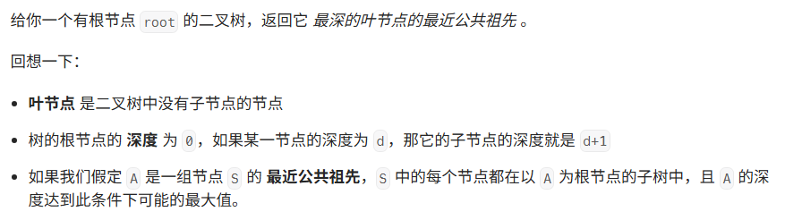

题目：


代码：
```java
class Solution {
    private record Pair(int height, TreeNode lca){}

    public TreeNode lcaDeepestLeaves(TreeNode root) {
        return dfs(root).lca;
    }
    private Pair dfs(TreeNode node) {
        if(node == null) {
            return new Pair(0, null);
        }

        Pair left = dfs(node.left);
        Pair right = dfs(node.right);
        if(left.height > right.height) {
            //左子树更高，应当返回左子树的lca
            return new Pair(left.height + 1, left.lca);
        }
        if(left.height < right.height) {
            //右子树更高，应当返回右子树的lca
            return new Pair(right.height + 1, right.lca);
        }
        //左右子树高度相同 返回当前节点
        return new Pair(left.height + 1, node);
    }
}
```