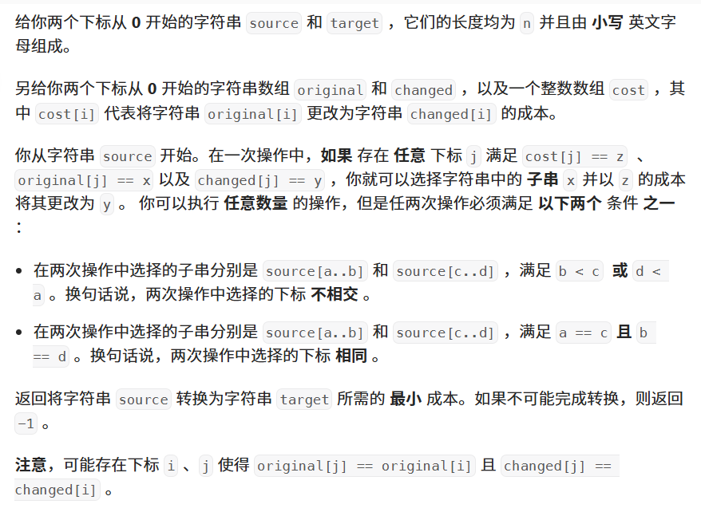

题目：


代码：
```java
class Solution {
    private Node root = new Node();
    private int sid = 0;
    private static final int INF = Integer.MAX_VALUE / 2;

    public long minimumCost(String source, String target, String[] original, String[] changed, int[] cost) {

        // Floyd算法计算最短路径
        int m = cost.length;
        // original 和 changed 的字符串都需要编号，最多有 2*m 个字符串
        int[][] dis = new int[m * 2][m * 2];
        // 初始化距离矩阵
        for(int i = 0;i < dis.length;++i) {
            Arrays.fill(dis[i], INF);
            dis[i][i] = 0;
        }
        // 构造图的 邻接矩阵
        for(int i = 0;i < m;++i) {
            int x = put(original[i]);
            int y = put(changed[i]);
            dis[x][y] = Math.min(dis[x][y], cost[i]);
        }
        for(int k = 0;k < sid;++k) {
            for(int i = 0;i < sid;++i) {
                if(dis[i][k] == INF) {
                    continue;
                }
                for(int j = 0;j < sid;++j) {
                    dis[i][j] = Math.min(dis[i][j], dis[i][k] + dis[k][j]);
                }
            }
        }

        // 动态规划解决问题
        char[] s = source.toCharArray();
        char[] t = target.toCharArray();
        int n = s.length;
        long[] f = new long[n + 1];
        for(int i = n - 1;i >= 0;--i) {
            f[i] = s[i] == t[i] ? f[i + 1] : Long.MAX_VALUE / 2;
            Node p = root, q = root;
            for(int j = i;j < n;++j) {
                p = p.son[s[j] - 'a'];
                q = q.son[t[j] - 'a'];
                if(p == null || q == null) {
                    break;
                }
                if(p.sid < 0 || q.sid < 0) {
                    continue;
                }
                // 可以修改[i,j]这段
                int d = dis[p.sid][q.sid];
                if(d < INF) {
                    f[i] = Math.min(f[i], d + f[j + 1]);
                }
            }
        }
        return f[0] < Long.MAX_VALUE / 2 ? f[0] : -1;
    }

    private int put(String s) {
        Node cur = root;
        for(char c: s.toCharArray()) {
            int i = c - 'a';
            if(cur.son[i] == null) {
                cur.son[i] = new Node();
            }
            cur = cur.son[i];
        }
        if(cur.sid < 0) {
            cur.sid = sid++;
        }
        return cur.sid;
    }
}

class Node {
    Node[] son = new Node[26];
    int sid = -1;
}  
```