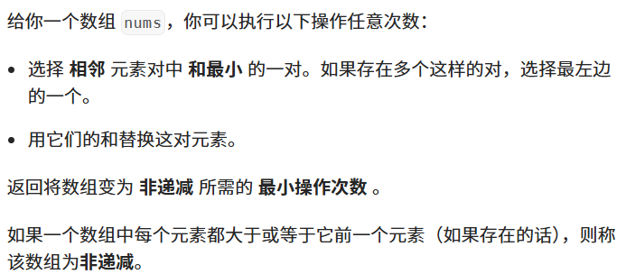

题目：


代码：
```java
class Solution {
    private record Pair(long s, int i) {
    }

    public int minimumPairRemoval(int[] nums) {
        int n = nums.length;
        PriorityQueue<Pair> q = new PriorityQueue<>((a, b) -> a.s != b.s ? Long.compare(a.s, b.s) : a.i - b.i);
        int dec = 0;
        for (int i = 0; i < n - 1; ++i) {
            int x = nums[i], y = nums[i + 1];
            if (x > y) {
                dec++;
            }
            q.offer(new Pair(x + y, i));
        }
		
		// 两个数组模拟双向链表
        int[] left = new int[n + 1];
        int[] right = new int[n + 1];
        for (int i = 0; i <= n; ++i) {
            left[i] = i - 1;
            right[i] = i + 1;
        }
        // 存放更新后的数据
        long[] a = new long[n];
        for (int i = 0; i < n; ++i) {
            a[i] = nums[i];
        }
        int res = 0;
        while (dec > 0) {
            res++;
            // =n 的点是被删除的
            // 后面的是指之前初始化的残留数据
            while (right[q.peek().i] >= n || q.peek().s != a[q.peek().i] + a[right[q.peek().i]]) {
                q.poll();
            }
            Pair p = q.poll();
            long s = p.s;
            int i = p.i;
			// 下一个数
            int nxt = right[i];
            if (a[i] > a[nxt]) {
                dec--;
            }
			// 前一个数据
            int pre = left[i];
            if (pre >= 0) {
                if (a[pre] > a[i]) {
                    dec--;
                }

                if (a[pre] > s) {
                    dec++;
                }
                q.offer(new Pair(a[pre] + s, pre));
            }
			// 下下一个数据
            int nxt2 = right[nxt];
            if (nxt2 < n) {
                if (a[nxt] > a[nxt2]) {
                    dec--;
                }
                if (s > a[nxt2]) {
                    dec++;
                }
                q.offer(new Pair(s + a[nxt2], i));
            }
			// 更新数据
            a[i] = s;

            // 删除 nxt
            int l = left[nxt];
            int r = right[nxt];
            right[l] = r;
            left[r] = l;
            right[nxt] = n; // 表示删除 nxt
        }
        return res;
    }
}
```

<font color="#ff0000">注：</font>使用了懒删除堆