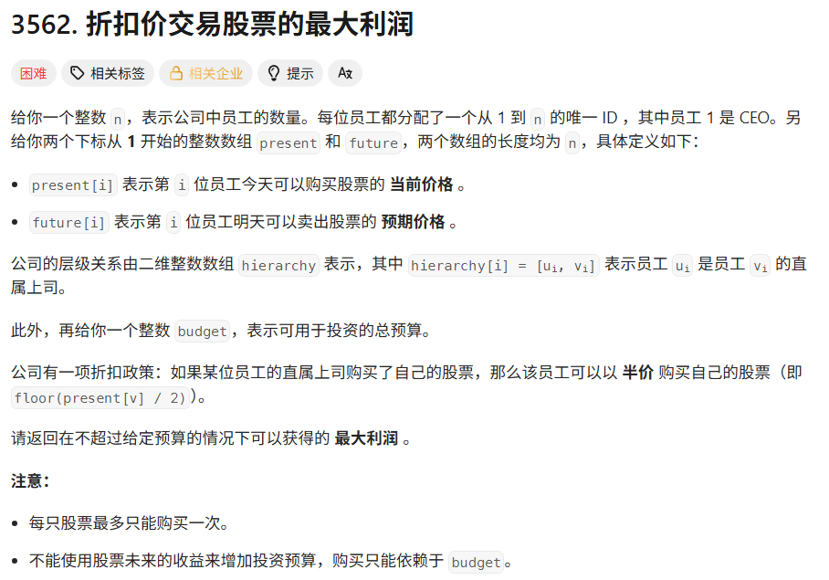

## 题目



## 代码

```java
public int maxProfit(int n, int[] present, int[] future, int[][] hierarchy, int budget) {  
    List<Integer>[] g = new ArrayList[n+1];  
    Arrays.setAll(g, i -> new ArrayList<>());  
    for(int[] h:  hierarchy) {  
        g[h[0]].add(h[1]);  
    }  
    // root = 1  
    int[][] f1 = dfs(1, g, present, future, budget);  
    return f1[budget][0];  
}  
  
private int[][] dfs(int u, List<Integer>[] g, int[] present, int[] future, int budget) {  
    // 计算从u开始的所有儿子子树v中能得到的最大利润和  
    // 第二维表示能否半价买，0否1是  
    int[][] subF = new int[budget + 1][2];  
    for(int v: g[u]) {  
        // 搜索v能获得的最大利润  
        int[][] fv = dfs(v, g, present, future, budget);  
        // 迭代处理求k个子节点得到的最大利润和  
        for(int j = budget; j >= 0; j--) {  
            // j表示分配给v的预算  
            // 类似于一个01背包问题  
            // fv[jv][k]中jv表示的是价值  
            // 每次都会把已经求了子节点当成整体  
            for(int jv = 0; jv <= j; jv++) {  
                for(int k = 0;k < 2;++k) {  
                    subF[j][k] = Math.max(subF[j][k], subF[j - jv][k] + fv[jv][k]);  
                }  
            }  
        }  
    }  
  
    // 计算从u开始的子树中能得到的最大利润  
    int[][] f = new int[budget + 1][2];  
    for(int j = 0;j <= budget;++j) {  
        for(int k = 0;k < 2;++k) {  
            int cost = present[u - 1] / (k + 1);  
            // 有预算买u  
            if(j >= cost) {  
                // 买u或者不买u的最大利润  
                f[j][k] = Math.max(subF[j][0], subF[j - cost][1] + future[u - 1] - cost);  
            }else {  
                f[j][k] = subF[j][0];  
            }  
        }  
    }  
    return f;  
}
```