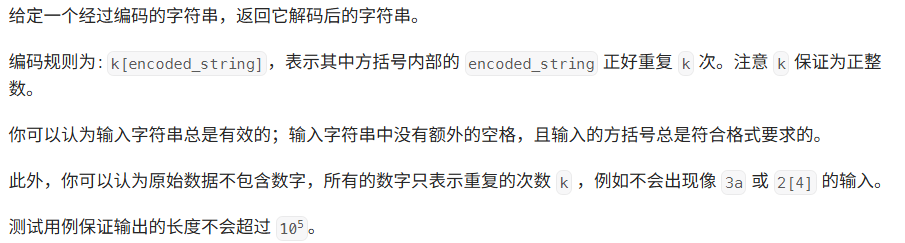

### 题目


### 代码
```java
class Solution {
    private record Pair(String s, int k){}

    public String decodeString(String s) {
        Deque<Pair> st = new ArrayDeque<>();
        StringBuilder res = new StringBuilder();
        int k = 0;
        for(char c: s.toCharArray()) {
            if(Character.isLetter(c)) {
                res.append(c);
            }else if(Character.isDigit(c)) {
                k = 10 * k + (c - '0');
            }else if(c == '['){
	            // 存储数字k及其之前的字符串
                st.push(new Pair(res.toString(), k));
                // 清空 res 和 k
                res.setLength(0);
                k = 0;
            }else {
                // c == ']'
                Pair p = st.pop();
                // 当前 res 的重复次数在栈首存储
                res = new StringBuilder(p.s).repeat(res, p.k);
            }
        }
        return res.toString();
    }
}
```
