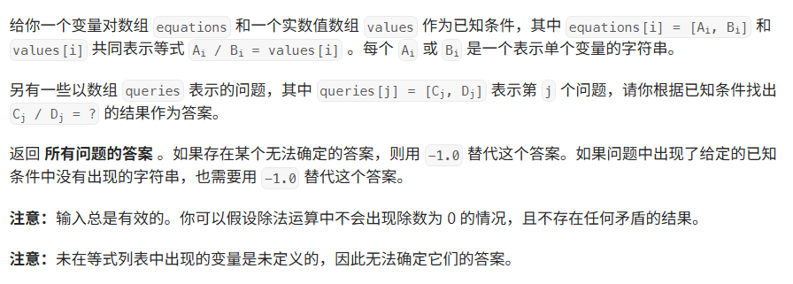

题目：


代码：
```java
class Solution {
    public double[] calcEquation(List<List<String>> equations, double[] values, List<List<String>> queries) {
        Map<String, Integer> variableToId = new HashMap<>();
        for(List<String> equation : equations) {
            for(String s: equation) {
                variableToId.putIfAbsent(s, variableToId.size());
            }
        }
        
        UnionFind uf = new UnionFind(variableToId.size());
        for(int i = 0;i < equations.size(); i++) {
            List<String> equation = equations.get(i);
            uf.merge(variableToId.get(equation.get(1)), variableToId.get(equation.get(0)), values[i]);
        }
        
        // 回答queries
        double[] res = new double[queries.size()];
        for(int i = 0; i < queries.size(); i++) { 
            List<String> query = queries.get(i);
            Integer x = variableToId.get(query.get(0));
            Integer y = variableToId.get(query.get(1));
            if(x != null && y != null && uf.isSame(x, y)) { 
                res[i] = uf.mul[y] / uf.mul[x];
            }else {
                res[i] = -1.0;
            }
        }
        return res;
    }
}

class UnionFind {
    private final int[] fa;
    // mul[x] * x = find(x)
    public final double[] mul;
    public UnionFind(int n) {
        fa = new int[n];
        for(int i = 0; i < n; i++) {
            fa[i] = i;
        }
        mul = new double[n];
        Arrays.fill(mul, 1.0);
    }
    
    private int find(int x) {
        if(x != fa[x]) {
            int root = find(fa[x]);
            mul[x] *= mul[fa[x]];
            fa[x] = root;
        }
        return fa[x];
    }
    
    public boolean isSame(int x, int y) {
        return find(x) == find(y);
    }
    
    public void merge(int from, int to, double value) {
        int x = find(from), y = find(to);
        if(x == y) {
            return;
        }
        // x / from = mul[from], y / to = mul[to], to / from = value;
        // y / from = (y/x) * (x/from) = (y/to) * (to/from)
        // y / x = (y / to) / (x / from) * (to / from)
        mul[x] = mul[to] * value / mul[from];
        fa[x] = y;
    }
}
```