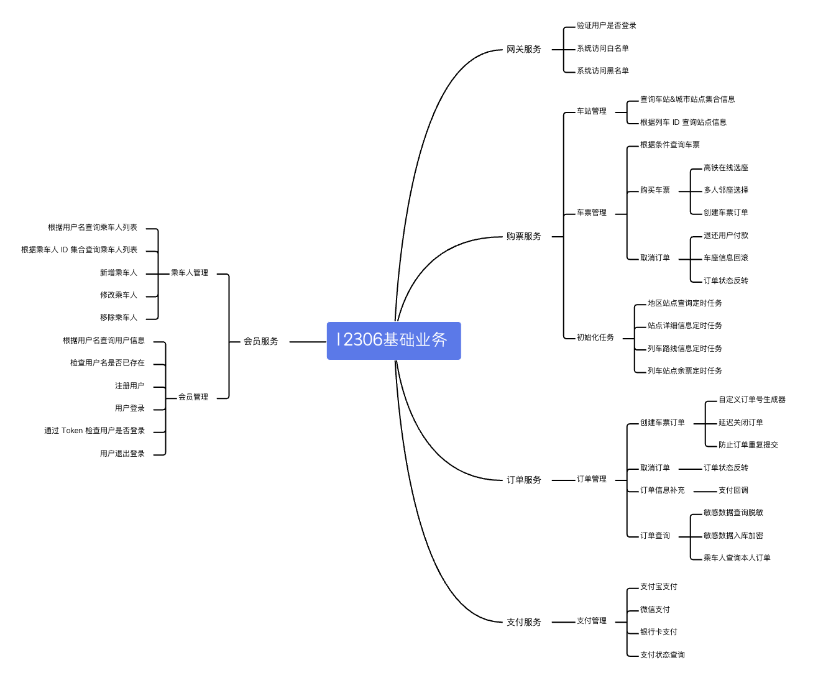

## 服务预览

## 具体服务
购票服务：
- 车站管理
- 车票管理
- 初始化任务

****
订单服务-订单管理：
- 创建车票订单
- 取消订单
- 订单信息补充
- 订单查询

****
支付服务-支付管理：
- 支付宝支付
- ~~微信支付~~
- ~~银行卡支付~~
- 支付状态查询

****
会员服务：
- 乘车人管理
- 会员管理(积分制度)

****
网关服务：
- 验证用户是否登录
- 系统访问白名单
- 系统访问黑名单

****
库存服务：
- 库存中心：余票查询、扣减库存
- 余票监控(候补机制)
- 缓存预热
- 分段库存(C, S, G, D)
- 消息中心(通知服务)

[12306项目流程](JavaStudy/project/rail-project/流程学习.md)