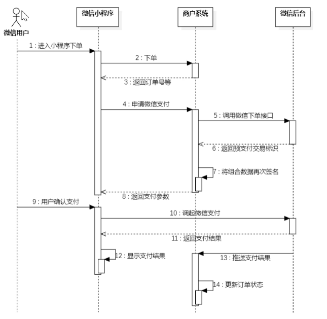

# 一、Swagger
[官网](https://swagger.org.cn/docs/)  
Knife4j是为Java MVC框架集成的Swagger生成API文档的增强解决方案  

步骤：  
- 创建WebMvcConfiguration配置类

常用注解：
- <font color="YELLOW">@Tag</font>: 类上(controller), 表示对类的说明
- <font color="YELLOW">@Schema</font>: 类上(entity, dto, vo), 表示对类用途的说明
- <font color="YELLOW">@Schema</font>: 属性上, 描述属性信息
- <font color="YELLOW">@Operation</font>: 方法上(controller的方法上), 说明方法的用途、作用

# 二、基础业务

## 2.1 购物车功能

### 清除购物车
购物车的数据存储在 redis 里面，便于清理，但是清除购物车的时候就会出现BigKey问题
```java
// 解决方式：不使用 delete, 使用unlink
public void clean() {  
    String cartKey = RedisConstant.SHOPPING_CART_KEY + UserHolder.getCurrentId();  
    // stringRedisTemplate.delete(cartKey);  
    stringRedisTemplate.unlink(cartKey);
}
```

### 添加商品到购物车
使用Hash数据结构，以`[dishId ? 0]:[setmealId ? 0]:[dishFlavor ? none]` 作为 field , value 表示的是物品数量  

### 删除购物车商品
删除的时候数据变化与删除 field 是异步的，并发状态下会导致问题，可以使用 Lua 脚本进行优化
```java
public void sub(CartDTO cartDTO) {  
    String cartKey = RedisConstant.SHOPPING_CART_KEY + UserHolder.getCurrentId();  
    String field = buildField(cartDTO);   
    // 下面这个会在高并发出现问题
    /*
    String val = (String) stringRedisTemplate.opsForHash().get(caryKey, field);
    if(val == null) return ;
    long num = Long.valueOf(val);
    if(num > 1) {
	    stringRedisTemplate.opsForHash().increment(cartKey, field, -1);
    }else {
	    stringRedisTemplate.opsForHash().delete(cartKey, field);
    }
    */
    
    Long res = stringRedisTemplate.opsForHash().increment(cartKey, field, -1); 
    // TODO 若是redis出现问题会导致出现脏数据  
    if(res <= 0) {  
        stringRedisTemplate.opsForHash().delete(cartKey, field);  
    }  
}
```

Lua脚本：
```lua
local count = redis.call('HINCRBY', KEYS[1], ARGV[1], -1)
if count <= 0 then
	redis.call('HDEL', KEYS[1], ARGV[1])
end
return count
```

运行脚本：
```java
// 避免重复解析脚本
private static final DefaultRedisScript<Long> DECREMENT_CART_SCRIPT;

static { 
	DECREMENT_CART_SCRIPT = new DefaultRedisScript<>();
	DECREMENT_CART_SCRIPT.setScriptText(luaScript);
	DECREMENT_CART_SCRIPT.setResultType(Long.class); 
}

Long remaining = stringRedisTemplate.execute(
		DECREMENT_CART_SCRIPT, 
		Collections.singletonList(cartKey), 
		productId);
```

### 查看购物车商品
由于商品很多，一个一个的去查会浪费大量时间，可以分为查询菜品和查询套餐，通过集合查询去一次性拉出来，最后在逐个处理
[Collectors学习](../../Java进阶学习/Collectors.md) 

## 2.2 订单相关功能

### 生成唯一订单ID
```java
public class SnowflakeIdGenerator {  
  
    // 起始时间戳 (例如：2023-01-01)，一旦确定不可修改  
    private final long twepoch = 1672531200000L;  
  
    // 各部分占用的位数  
    private final long workerIdBits = 5L;   // 机器标识占用的位数  
    private final long datacenterIdBits = 5L; // 数据中心占用的位数  
    private final long sequenceBits = 12L;  // 序列号占用的位数  
  
    // 各部分最大值 (位运算计算)  
    private final long maxWorkerId = ~(-1L << workerIdBits);  
    private final long maxDatacenterId = ~(-1L << datacenterIdBits);  
    private final long sequenceMask = ~(-1L << sequenceBits);  
  
    // 各部分向左移位的位数  
    private final long workerIdShift = sequenceBits;  
    private final long datacenterIdShift = sequenceBits + workerIdBits;  
    private final long timestampLeftShift = sequenceBits + workerIdBits + datacenterIdBits;  
  
    private long workerId;        // 工作机器ID  
    private long datacenterId;    // 数据中心ID  
    private long sequence = 0L;   // 毫秒内序列  
    private long lastTimestamp = -1L; // 上次生成ID的时间戳  
  
    public SnowflakeIdGenerator(long workerId, long datacenterId) {  
        if (workerId > maxWorkerId || workerId < 0) {  
            throw new IllegalArgumentException("worker Id can't be greater than maxWorkerId");  
        }  
        if (datacenterId > maxDatacenterId || datacenterId < 0) {  
            throw new IllegalArgumentException("datacenter Id can't be greater than maxDatacenterId");  
        }  
        this.workerId = workerId;  
        this.datacenterId = datacenterId;  
    }  
  
    // 核心方法：生成ID (线程安全)  
    public synchronized long nextId() {  
        long timestamp = timeGen();  
  
        // 检查时钟回拨  
        if (timestamp < lastTimestamp) {  
            throw new RuntimeException("时钟回拨，拒绝生成ID");  
        }  
  
        // 如果是同一毫秒内生成的，则进行毫秒内序列自增  
        if (lastTimestamp == timestamp) {  
            sequence = (sequence + 1) & sequenceMask;  
            // 毫秒内序列溢出  
            if (sequence == 0) {  
                // 阻塞到下一个毫秒,获得新的时间戳  
                timestamp = tilNextMillis(lastTimestamp);  
            }  
        } else {  
            // 时间戳改变，毫秒内序列重置  
            sequence = 0L;  
        }  
  
        lastTimestamp = timestamp;  
  
        // 通过位运算拼装成 64 位 ID        
        return ((timestamp - twepoch) << timestampLeftShift) // 时间戳差值左移  
                | (datacenterId << datacenterIdShift)         // 数据中心左移  
                | (workerId << workerIdShift)                 // 机器ID左移  
                | sequence;                                   // 序列号  
    }  
  
    protected long tilNextMillis(long lastTimestamp) {  
        long timestamp = timeGen();  
        while (timestamp <= lastTimestamp) {  
            timestamp = timeGen();  
        }  
        return timestamp;  
    }  
  
    protected long timeGen() {  
        return System.currentTimeMillis();  
    }  
}
```

### RedisUtils
这个代码只针对 string 类型，一般 hash 和 string 两种类型用 <font color="#b2a2c7">StringRedisTemplate</font> 
```java
public class RedisUtils {  
    private StringRedisTemplate redisTemplate;  
    private ObjectMapper objectMapper;  
  
    /**  
     * 写入缓存（永久有效）  
     */  
    public void set(String key, Object value) {  
        set(key, value, -1, TimeUnit.SECONDS);  
    }  
  
    /**  
     * 写入缓存（设置过期时间）  
     */  
    public void set(String key, Object value, long timeout, TimeUnit unit) {  
        try {  
            String val = toJson(value);  
            if (timeout > 0) {  
                redisTemplate.opsForValue().set(key, val, timeout, unit);  
            } else {  
                redisTemplate.opsForValue().set(key, val);  
            }  
        } catch (Exception e) {  
            log.error("Redis set error! key: {}, error: {}", key, e.getMessage());  
        }  
    }  
  
    /**  
     * 获取对象  
     */  
    public <T> T get(String key, Class<T> clazz) {  
        String val = redisTemplate.opsForValue().get(key);  
        if (!StringUtils.hasText(val)) return null;  
        return fromJson(val, clazz);  
    }  
  
    /**  
     * 获取复杂类型（如 List<User>）  
     * 调用示例：List<User> list = redisUtils.get("userList", new TypeReference<List<User>>(){});  
     */    
     public <T> T get(String key, TypeReference<T> typeReference) {  
        String val = redisTemplate.opsForValue().get(key);  
        if (!StringUtils.hasText(val)) return null;  
        try {  
            return objectMapper.readValue(val, typeReference);  
        } catch (JsonProcessingException e) {  
            log.error("Redis get error! key: {}, error: {}", key, e.getMessage());  
            return null;  
        }  
    }  
  
    /**  
     * 删除 key  
     */    
     public Boolean delete(String key) {  
        return redisTemplate.delete(key);  
    }  
  
    /**  
     * 设置过期时间  
     */  
    public Boolean expire(String key, long timeout, TimeUnit unit) {  
        return redisTemplate.expire(key, timeout, unit);  
    }  
  
    // --- 内部辅助转换方法 ---  
    private String toJson(Object value) throws JsonProcessingException {  
        if (value == null) return null;  
        if (value instanceof String) return (String) value;  
        return objectMapper.writeValueAsString(value);  
    }  
  
    private <T> T fromJson(String json, Class<T> clazz) {  
        try {  
            if (clazz == String.class) {  
                return clazz.cast(json);  
            }  
            return objectMapper.readValue(json, clazz);  
        } catch (JsonProcessingException e) {  
            log.error("Json parse error! error: {}", e.getMessage());  
            return null;  
        }  
    }  
}
```

### RedisConfig
```java
public class RedisConfig {  
  
    @Bean  
    public RedisTemplate<String, Object> redisTemplate(RedisConnectionFactory factory) {  
        RedisTemplate<String, Object> template = new RedisTemplate<>();  
        template.setConnectionFactory(factory);  
  
        // 1. 使用 JSON 序列化器  
        GenericJackson2JsonRedisSerializer jsonSerializer = new GenericJackson2JsonRedisSerializer();  
  
        // 2. Key 始终使用 String 序列化  
        StringRedisSerializer stringSerializer = new StringRedisSerializer();  
  
        // 全局配置：Key 和 HashKey 用 String        template.setKeySerializer(stringSerializer);  
        template.setHashKeySerializer(stringSerializer);  
  
        // 全局配置：Value 和 HashValue 用 JSON        // 这样你存 List<User> 或 Map<String, Dish> 都能自动转 JSON 并带上类型  
        template.setValueSerializer(jsonSerializer);  
        template.setHashValueSerializer(jsonSerializer);  
  
        template.afterPropertiesSet();  
        return template;  
    }  
  
    // 专门为 Spring Cache 注解配置序列化  
    @Bean  
    public RedisCacheConfiguration redisCacheConfiguration() {  
        return RedisCacheConfiguration.defaultCacheConfig()  
                .entryTtl(Duration.ofHours(1)) // 设置默认过期时间  
                // 设置 Key 的序列化  
                .serializeKeysWith(RedisSerializationContext.SerializationPair.fromSerializer(new StringRedisSerializer()))  
                // 设置 Value 的序列化（使用带类型的 JSON，这样拿出来不用手动转）  
                .serializeValuesWith(RedisSerializationContext.SerializationPair.fromSerializer(new GenericJackson2JsonRedisSerializer()))  
                .disableCachingNullValues(); // 不缓存空值  
    }  
}
```

### 微信支付
[平台](https://pay.weixin.qq.com/static/product/product_index.shtml) 

流程时序图：


配置修改：
```java
@Component  
@ConfigurationProperties(prefix = "sky.wechat")  
@Data  
public class WeChatProperties {  
    private String appid; //小程序的appid  
    private String secret; //小程序的秘钥  
    private String mchid; //商户号  
    private String mchSerialNo; //商户API证书的证书序列号  
    private String privateKeyFilePath; //商户私钥文件  
    private String apiV3Key; //证书解密的密钥  
    private String weChatPayCertFilePath; //平台证书  
    private String notifyUrl; //支付成功的回调地址  
    private String refundNotifyUrl; //退款成功的回调地址  
}
```
配置文件修改：
```yml
wechat:  
  appid: ${sky.wechat.appid}  
  secret: ${sky.wechat.secret}  
  mchid : ${sky.wechat.mchid}  
  mchSerialNo: ${sky.wechat.mchSerialNo}  
  privateKeyFilePath: ${sky.wechat.privateKeyFilePath}  
  apiV3Key: ${sky.wechat.apiV3Key}  
  weChatPayCertFilePath: ${sky.wechat.weChatPayCertFilePath}  
  notifyUrl: ${sky.wechat.notifyUrl}  
  refundNotifyUrl: ${sky.wechat.refundNotifyUrl}
  
sky:  
  wechat:  
    appid: wxffb3637a228223b8  
    secret: 84311df9199ecacdf4f12d27b6b9522d  
    mchid : 1561414331  
    mchSerialNo: 4B3B3DC35414AD50B1B755BAF8DE9CC7CF407606  
    privateKeyFilePath: D:\pay\apiclient_key.pem  
    apiV3Key: CZBK51236435wxpay435434323FFDuv3  
    weChatPayCertFilePath: D:\pay\wechatpay_166D96F876F45C7D07CE98952A96EC980368ACFC.pem  
    notifyUrl: https://58869fb.r2.cpolar.top/notify/paySuccess  
    refundNotifyUrl: https://58869fb.r2.cpolar.top/notify/refundSuccess
```
完整代码：
```java
// Controller层
@PutMapping("/payment")  
@ApiOperation("订单支付")  
public Result<OrderPaymentVO> payment(@RequestBody OrdersPaymentDTO ordersPaymentDTO) throws Exception {  
    log.info("订单支付：{}", ordersPaymentDTO);  
    OrderPaymentVO orderPaymentVO = orderService.payment(ordersPaymentDTO);  
    log.info("生成预支付交易单：{}", orderPaymentVO);  
    return Result.success(orderPaymentVO);  
}


// Service
public OrderPaymentVO payment(OrdersPaymentDTO ordersPaymentDTO) throws Exception {  
    // 当前登录用户id  
    Long userId = BaseContext.getCurrentId();  
    User user = userMapper.getById(userId);  
  
    //调用微信支付接口，生成预支付交易单  
    JSONObject jsonObject = weChatPayUtil.pay(  
            ordersPaymentDTO.getOrderNumber(), //商户订单号  
            new BigDecimal(0.01), //支付金额，单位 元  
            "苍穹外卖订单", //商品描述  
            user.getOpenid() //微信用户的openid  
    );  
  
    if (jsonObject.getString("code") != null && jsonObject.getString("code").equals("ORDERPAID")) {  
        throw new OrderBusinessException("该订单已支付");  
    }  
  
    OrderPaymentVO vo = jsonObject.toJavaObject(OrderPaymentVO.class);  
    vo.setPackageStr(jsonObject.getString("package"));  
  
    return vo;  
}  
public void paySuccess(String outTradeNo) {  
    // 当前登录用户id  
    Long userId = BaseContext.getCurrentId();  
  
    // 根据订单号查询当前用户的订单  
    Orders ordersDB = orderMapper.getByNumberAndUserId(outTradeNo, userId);  
  
    // 根据订单id更新订单的状态、支付方式、支付状态、结账时间  
    Orders orders = Orders.builder()  
            .id(ordersDB.getId())  
            .status(Orders.TO_BE_CONFIRMED)  
            .payStatus(Orders.PAID)  
            .checkoutTime(LocalDateTime.now())  
            .build();  
  
    orderMapper.update(orders);  
  
    //通过websocket向客户端浏览器推送消息 type orderId content    Map map = new HashMap();  
    map.put("type",1); // 1表示来单提醒 2表示客户催单  
    map.put("orderId",ordersDB.getId());  
    map.put("content","订单号：" + outTradeNo);  
  
    String json = JSON.toJSONString(map);  
    webSocketServer.sendToAllClient(json);  
}


// WechatPayUtil
@Component  
public class WeChatPayUtil {  
  
    //微信支付下单接口地址  
    public static final String JSAPI = "https://api.mch.weixin.qq.com/v3/pay/transactions/jsapi";  
  
    //申请退款接口地址  
    public static final String REFUNDS = "https://api.mch.weixin.qq.com/v3/refund/domestic/refunds";  
  
    @Autowired  
    private WeChatProperties weChatProperties;  
  
    /**  
     * 获取调用微信接口的客户端工具对象  
     *  
     * @return  
     */  
    private CloseableHttpClient getClient() {  
        PrivateKey merchantPrivateKey = null;  
        try {  
            //merchantPrivateKey商户API私钥，如何加载商户API私钥请看常见问题  
            merchantPrivateKey = PemUtil.loadPrivateKey(new FileInputStream(new File(weChatProperties.getPrivateKeyFilePath())));  
            //加载平台证书文件  
            X509Certificate x509Certificate = PemUtil.loadCertificate(new FileInputStream(new File(weChatProperties.getWeChatPayCertFilePath())));  
            //wechatPayCertificates微信支付平台证书列表。你也可以使用后面章节提到的“定时更新平台证书功能”，而不需要关心平台证书的来龙去脉  
            List<X509Certificate> wechatPayCertificates = Arrays.asList(x509Certificate);  
  
            WechatPayHttpClientBuilder builder = WechatPayHttpClientBuilder.create()  
                    .withMerchant(weChatProperties.getMchid(), weChatProperties.getMchSerialNo(), merchantPrivateKey)  
                    .withWechatPay(wechatPayCertificates);  
  
            // 通过WechatPayHttpClientBuilder构造的HttpClient，会自动的处理签名和验签  
            CloseableHttpClient httpClient = builder.build();  
            return httpClient;  
        } catch (FileNotFoundException e) {  
            e.printStackTrace();  
            return null;  
        }  
    }  
  
    /**  
     * 发送post方式请求  
     *  
     * @param url  
     * @param body  
     * @return  
     */  
    private String post(String url, String body) throws Exception {  
        CloseableHttpClient httpClient = getClient();  
  
        HttpPost httpPost = new HttpPost(url);  
        httpPost.addHeader(HttpHeaders.ACCEPT, ContentType.APPLICATION_JSON.toString());  
        httpPost.addHeader(HttpHeaders.CONTENT_TYPE, ContentType.APPLICATION_JSON.toString());  
        httpPost.addHeader("Wechatpay-Serial", weChatProperties.getMchSerialNo());  
        httpPost.setEntity(new StringEntity(body, "UTF-8"));  
  
        CloseableHttpResponse response = httpClient.execute(httpPost);  
        try {  
            String bodyAsString = EntityUtils.toString(response.getEntity());  
            return bodyAsString;  
        } finally {  
            httpClient.close();  
            response.close();  
        }  
    }  
  
    /**  
     * 发送get方式请求  
     *  
     * @param url  
     * @return  
     */  
    private String get(String url) throws Exception {  
        CloseableHttpClient httpClient = getClient();  
  
        HttpGet httpGet = new HttpGet(url);  
        httpGet.addHeader(HttpHeaders.ACCEPT, ContentType.APPLICATION_JSON.toString());  
        httpGet.addHeader(HttpHeaders.CONTENT_TYPE, ContentType.APPLICATION_JSON.toString());  
        httpGet.addHeader("Wechatpay-Serial", weChatProperties.getMchSerialNo());  
  
        CloseableHttpResponse response = httpClient.execute(httpGet);  
        try {  
            String bodyAsString = EntityUtils.toString(response.getEntity());  
            return bodyAsString;  
        } finally {  
            httpClient.close();  
            response.close();  
        }  
    }  
  
    /**  
     * jsapi下单  
     *  
     * @param orderNum    商户订单号  
     * @param total       总金额  
     * @param description 商品描述  
     * @param openid      微信用户的openid  
     * @return  
     */  
    private String jsapi(String orderNum, BigDecimal total, String description, String openid) throws Exception {  
        JSONObject jsonObject = new JSONObject();  
        jsonObject.put("appid", weChatProperties.getAppid());  
        jsonObject.put("mchid", weChatProperties.getMchid());  
        jsonObject.put("description", description);  
        jsonObject.put("out_trade_no", orderNum);  
        jsonObject.put("notify_url", weChatProperties.getNotifyUrl());  
  
        JSONObject amount = new JSONObject();  
        amount.put("total", total.multiply(new BigDecimal(100)).setScale(2, BigDecimal.ROUND_HALF_UP).intValue());  
        amount.put("currency", "CNY");  
  
        jsonObject.put("amount", amount);  
  
        JSONObject payer = new JSONObject();  
        payer.put("openid", openid);  
  
        jsonObject.put("payer", payer);  
  
        String body = jsonObject.toJSONString();  
        return post(JSAPI, body);  
    }  
  
    /**  
     * 小程序支付  
     *  
     * @param orderNum    商户订单号  
     * @param total       金额，单位 元  
     * @param description 商品描述  
     * @param openid      微信用户的openid  
     * @return  
     */  
    public JSONObject pay(String orderNum, BigDecimal total, String description, String openid) throws Exception {  
        //统一下单，生成预支付交易单  
        String bodyAsString = jsapi(orderNum, total, description, openid);  
        //解析返回结果  
        JSONObject jsonObject = JSON.parseObject(bodyAsString);  
        System.out.println(jsonObject);  
  
        String prepayId = jsonObject.getString("prepay_id");  
        if (prepayId != null) {  
            String timeStamp = String.valueOf(System.currentTimeMillis() / 1000);  
            String nonceStr = RandomStringUtils.randomNumeric(32);  
            ArrayList<Object> list = new ArrayList<>();  
            list.add(weChatProperties.getAppid());  
            list.add(timeStamp);  
            list.add(nonceStr);  
            list.add("prepay_id=" + prepayId);  
            //二次签名，调起支付需要重新签名  
            StringBuilder stringBuilder = new StringBuilder();  
            for (Object o : list) {  
                stringBuilder.append(o).append("\n");  
            }  
            String signMessage = stringBuilder.toString();  
            byte[] message = signMessage.getBytes();  
  
            Signature signature = Signature.getInstance("SHA256withRSA");  
            signature.initSign(PemUtil.loadPrivateKey(new FileInputStream(new File(weChatProperties.getPrivateKeyFilePath()))));  
            signature.update(message);  
            String packageSign = Base64.getEncoder().encodeToString(signature.sign());  
  
            //构造数据给微信小程序，用于调起微信支付  
            JSONObject jo = new JSONObject();  
            jo.put("timeStamp", timeStamp);  
            jo.put("nonceStr", nonceStr);  
            jo.put("package", "prepay_id=" + prepayId);  
            jo.put("signType", "RSA");  
            jo.put("paySign", packageSign);  
  
            return jo;  
        }  
        return jsonObject;  
    }  
  
    /**  
     * 申请退款  
     *  
     * @param outTradeNo    商户订单号  
     * @param outRefundNo   商户退款单号  
     * @param refund        退款金额  
     * @param total         原订单金额  
     * @return  
     */  
    public String refund(String outTradeNo, String outRefundNo, BigDecimal refund, BigDecimal total) throws Exception {  
        JSONObject jsonObject = new JSONObject();  
        jsonObject.put("out_trade_no", outTradeNo);  
        jsonObject.put("out_refund_no", outRefundNo);  
  
        JSONObject amount = new JSONObject();  
        amount.put("refund", refund.multiply(new BigDecimal(100)).setScale(2, BigDecimal.ROUND_HALF_UP).intValue());  
        amount.put("total", total.multiply(new BigDecimal(100)).setScale(2, BigDecimal.ROUND_HALF_UP).intValue());  
        amount.put("currency", "CNY");  
  
        jsonObject.put("amount", amount);  
        jsonObject.put("notify_url", weChatProperties.getRefundNotifyUrl());  
  
        String body = jsonObject.toJSONString();  
  
        //调用申请退款接口  
        return post(REFUNDS, body);  
    }  
}


// notify的Controller
// 微信后台回调通知
@RestController  
@RequestMapping("/notify")  
@Slf4j  
public class PayNotifyController {  
    @Autowired  
    private OrderService orderService;  
    @Autowired  
    private WeChatProperties weChatProperties;  
  
    /**  
     * 支付成功回调  
     *  
     * @param request  
     */  
    @RequestMapping("/paySuccess")  
    public void paySuccessNotify(HttpServletRequest request, HttpServletResponse response) throws Exception {  
        //读取数据  
        String body = readData(request);  
        log.info("支付成功回调：{}", body);  
  
        //数据解密  
        String plainText = decryptData(body);  
        log.info("解密后的文本：{}", plainText);  
  
        JSONObject jsonObject = JSON.parseObject(plainText);  
        String outTradeNo = jsonObject.getString("out_trade_no");//商户平台订单号  
        String transactionId = jsonObject.getString("transaction_id");//微信支付交易号  
  
        log.info("商户平台订单号：{}", outTradeNo);  
        log.info("微信支付交易号：{}", transactionId);  
  
        //业务处理，修改订单状态、来单提醒  
        orderService.paySuccess(outTradeNo);  
  
        //给微信响应  
        responseToWeixin(response);  
    }  
  
    /**  
     * 读取数据  
     *  
     * @param request  
     * @return  
     * @throws Exception  
     */    private String readData(HttpServletRequest request) throws Exception {  
        BufferedReader reader = request.getReader();  
        StringBuilder result = new StringBuilder();  
        String line = null;  
        while ((line = reader.readLine()) != null) {  
            if (result.length() > 0) {  
                result.append("\n");  
            }  
            result.append(line);  
        }  
        return result.toString();  
    }  
  
    /**  
     * 数据解密  
     *  
     * @param body  
     * @return  
     * @throws Exception  
     */    private String decryptData(String body) throws Exception {  
        JSONObject resultObject = JSON.parseObject(body);  
        JSONObject resource = resultObject.getJSONObject("resource");  
        String ciphertext = resource.getString("ciphertext");  
        String nonce = resource.getString("nonce");  
        String associatedData = resource.getString("associated_data");  
  
        AesUtil aesUtil = new AesUtil(weChatProperties.getApiV3Key().getBytes(StandardCharsets.UTF_8));  
        //密文解密  
        String plainText = aesUtil.decryptToString(associatedData.getBytes(StandardCharsets.UTF_8),  
                nonce.getBytes(StandardCharsets.UTF_8),  
                ciphertext);  
  
        return plainText;  
    }  
  
    /**  
     * 给微信响应  
     * @param response  
     */  
    private void responseToWeixin(HttpServletResponse response) throws Exception{  
        response.setStatus(200);  
        HashMap<Object, Object> map = new HashMap<>();  
        map.put("code", "SUCCESS");  
        map.put("message", "SUCCESS");  
        response.setHeader("Content-type", ContentType.APPLICATION_JSON.toString());  
        response.getOutputStream().write(JSONUtils.toJSONString(map).getBytes(StandardCharsets.UTF_8));  
        response.flushBuffer();  
    }  
}
```


### Http工具类
代码模板：
```java
/**  
 * Http工具类  
 */  
public class HttpClientUtil {  
  
    static final  int TIMEOUT_MSEC = 5 * 1000;  
  
    /**  
     * 发送GET方式请求  
     * @param url  
     * @param paramMap  
     * @return  
     */  
    public static String doGet(String url,Map<String,String> paramMap){  
        // 创建Httpclient对象  
        CloseableHttpClient httpClient = HttpClients.createDefault();  
  
        String result = "";  
        CloseableHttpResponse response = null;  
  
        try{  
            URIBuilder builder = new URIBuilder(url);  
            if(paramMap != null){  
                for (String key : paramMap.keySet()) {  
                    builder.addParameter(key,paramMap.get(key));  
                }  
            }  
            URI uri = builder.build();  
  
            //创建GET请求  
            HttpGet httpGet = new HttpGet(uri);  
  
            //发送请求  
            response = httpClient.execute(httpGet);  
  
            //判断响应状态  
            if(response.getStatusLine().getStatusCode() == 200){  
                result = EntityUtils.toString(response.getEntity(),"UTF-8");  
            }  
        }catch (Exception e){  
            e.printStackTrace();  
        }finally {  
            try {  
                response.close();  
                httpClient.close();  
            } catch (IOException e) {  
                e.printStackTrace();  
            }  
        }  
  
        return result;  
    }  
  
    /**  
     * 发送POST方式请求  
     * @param url  
     * @param paramMap  
     * @return  
     * @throws IOException  
     */    
     public static String doPost(String url, Map<String, String> paramMap) throws IOException {  
        // 创建Httpclient对象  
        CloseableHttpClient httpClient = HttpClients.createDefault();  
        CloseableHttpResponse response = null;  
        String resultString = "";  
  
        try {  
            // 创建Http Post请求  
            HttpPost httpPost = new HttpPost(url);  
  
            // 创建参数列表  
            if (paramMap != null) {  
                List<NameValuePair> paramList = new ArrayList();  
                for (Map.Entry<String, String> param : paramMap.entrySet()) {  
                    paramList.add(new BasicNameValuePair(param.getKey(), param.getValue()));  
                }  
                // 模拟表单  
                UrlEncodedFormEntity entity = new UrlEncodedFormEntity(paramList);  
                httpPost.setEntity(entity);  
            }  
  
            httpPost.setConfig(builderRequestConfig());  
  
            // 执行http请求  
            response = httpClient.execute(httpPost);  
  
            resultString = EntityUtils.toString(response.getEntity(), "UTF-8");  
        } catch (Exception e) {  
            throw e;  
        } finally {  
            try {  
                response.close();  
            } catch (IOException e) {  
                e.printStackTrace();  
            }  
        }  
  
        return resultString;  
    }  
  
    /**  
     * 发送POST方式请求  
     * @param url  
     * @param paramMap  
     * @return  
     * @throws IOException  
     */    
     public static String doPost4Json(String url, Map<String, String> paramMap) throws IOException {  
        // 创建Httpclient对象  
        CloseableHttpClient httpClient = HttpClients.createDefault();  
        CloseableHttpResponse response = null;  
        String resultString = "";  
  
        try {  
            // 创建Http Post请求  
            HttpPost httpPost = new HttpPost(url);  
  
            if (paramMap != null) {  
                //构造json格式数据  
                JSONObject jsonObject = new JSONObject();  
                for (Map.Entry<String, String> param : paramMap.entrySet()) {  
                    jsonObject.put(param.getKey(),param.getValue());  
                }  
                StringEntity entity = new StringEntity(jsonObject.toString(),"utf-8");  
                //设置请求编码  
                entity.setContentEncoding("utf-8");  
                //设置数据类型  
                entity.setContentType("application/json");  
                httpPost.setEntity(entity);  
            }  
  
            httpPost.setConfig(builderRequestConfig());  
  
            // 执行http请求  
            response = httpClient.execute(httpPost);  
  
            resultString = EntityUtils.toString(response.getEntity(), "UTF-8");  
        } catch (Exception e) {  
            throw e;  
        } finally {  
            try {  
                response.close();  
            } catch (IOException e) {  
                e.printStackTrace();  
            }  
        }  
  
        return resultString;  
    }  
    private static RequestConfig builderRequestConfig() {  
        return RequestConfig.custom()  
                .setConnectTimeout(TIMEOUT_MSEC)  
                .setConnectionRequestTimeout(TIMEOUT_MSEC)  
                .setSocketTimeout(TIMEOUT_MSEC).build();  
    }  
  
}
```


